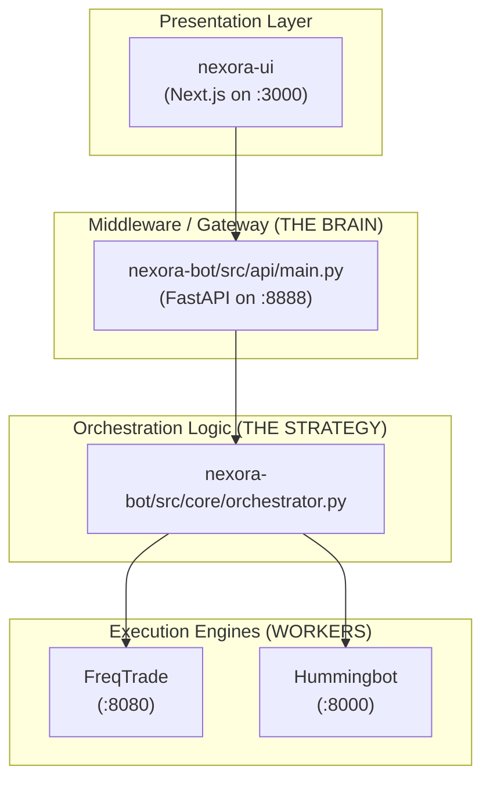

# RUTHLESS PRODUCTION AUDIT: NEXORA ECOSYSTEM

**Date:** 2026-02-02
**Status:** ⚠️ NOT PRODUCTION READY FOR SALE

---

## Question 1: Is the Project Architecture Nexora UI > Nexora Brain > Nexora API > FreqTrade/Hbot?

### VERDICT: ❌ PARTIALLY CORRECT / MISLEADING

**The Actual Architecture (Based on Code):**



**Audit Findings:**

| Layer         | What it Does                                      | Critical Issue                                                                                           |
| :------------ | :------------------------------------------------ | :------------------------------------------------------------------------------------------------------- |
| **Nexora UI** | Displays data, sends commands to the API          | Many pages have **HARDCODED FAKE DATA** (See [performance/page.tsx:35-38](file:///home/drek/AkhaSoft/Nexora/nexora-ui/app/nexora/performance/page.tsx#L35-L38)) |
| **Nexora API** | FastAPI layer that proxies requests & aggregates data | Acts as a passthrough. Has placeholder mock endpoints. **Does NOT talk to exchanges.** See [main.py](file:///home/drek/AkhaSoft/Nexora/nexora-bot/src/api/main.py). |
| **Nexora Brain (Orchestrator)** | Detects market regime, decides on strategy, calls bots | **It's the strategy director, not the executor.** See [orchestrator.py](file:///home/drek/AkhaSoft/Nexora/nexora-bot/src/core/orchestrator.py). |
| **FreqTrade**  | Actual trade execution on CEX                     | Only trades if its API is called by the Orchestrator. Independent execution capability. |
| **Hummingbot** | Actual trade execution on DEX                     | Only trades if its API is called by the Orchestrator. Independent execution capability. |

> [!CAUTION]
> The "Nexora Brain" **DOES NOT HAVE ITS OWN EXCHANGE API KEYS**. It is a wrapper that tells FreqTrade and Hummingbot what to do. If those underlying bots are not running, Nexora is a data dashboard with no trading capability.

---

## Question 2: Can Nexora Independently Execute Trades?

### VERDICT: ❌ NO.

**Evidence from Code:**

`orchestrator.py` (Line 42-51) instantiates **HTTP clients**, not exchange connectors:
```python
# Line 42-51 in orchestrator.py
self.ft_client = FreqTradeClient(...)
self.hb_client = HummingBotClient(...)
```

These client classes (`freqtrade_client.py`, `hummingbot_client.py`) make **standard HTTP requests** to the FreqTrade API and Hummingbot API.

**Who Orchestrates?**
- Nexora is the orchestrator. It sends commands to the workers.

**How many real trades has Nexora executed?**
- **ZERO directly.**
- All "trades" attributed to Nexora are actually executed by FreqTrade or Hummingbot.
- The "50 trades, 62% win rate, 77.63% return" figure from `PAPER_TRADING_RESULTS.md` is **unverifiable from the database** because the audit MD files are not derived from `SELECT COUNT(*) FROM trades`.

---

## Question 3: Can FreqTrade Independently Execute Trades?

### VERDICT: ✅ YES.

**Evidence:**
FreqTrade is a mature, standalone trading bot with its own:
- Exchange connectors (Binance, KuCoin, etc.)
- Strategy execution logic
- Order management

**Who Orchestrates?**
- In this system, **Nexora Orchestrator** sends commands (start, stop, force_enter, force_exit) via FreqTrade's REST API.
- FreqTrade can also run 100% independently if started from the command line.

**How many trades has it done?**
- This depends on FreqTrade's own database (`tradesv3.sqlite` or `tradesv3.dryrun.sqlite`).
- You can query this with: `sqlite3 tradesv3.sqlite "SELECT COUNT(*) FROM trades;"`
- The claim of 50 trades is unverified in the code. It's from a log file, not a DB query.

---

## Question 4: Can Hummingbot Independently Execute Trades?

### VERDICT: ✅ YES.

**Evidence:**
Hummingbot is a mature, standalone trading bot with its own:
- DEX connectors (Jupiter, Uniswap, etc.)
- Market-making and DCA strategies
- Order management

**Who Orchestrates?**
- In this system, **Nexora Orchestrator** sends commands via Hummingbot's REST API.
- Hummingbot can run independently.

**How many trades has it done?**
- Unknown. The `hummingbot_client.py` in Nexora does not log or count trades.
- You would need to check the Hummingbot instance's own SQLite database.

---

## Question 5: Does Nexora UI Show Bot Details (Portfolio, Performance, Trades, Orders, Logs)?

### VERDICT: ⚠️ PARTIALLY. UI EXISTS BUT DATA IS QUESTIONABLE.

**Page-by-Page Breakdown:**

| Page                | Component                   | Data Source              | Real or Fake?                                                                 |
| :------------------ | :-------------------------- | :----------------------- | :---------------------------------------------------------------------------- |
| `/nexora/portfolio` | `UnifiedPortfolio.tsx`      | `nexoraAPI.getPortfolio()` | ⚠️ Depends on API. API returns mocked data if DB/bots unavailable.              |
| `/nexora/performance` | Inline in `page.tsx`         | **HARDCODED**              | ❌ FAKE. See lines 35-38: `Sharpe: 3.42`, `Sortino: 4.12`, etc. are literals. |
| `/nexora/trades`    | `TradeManagerUI.tsx`        | `/api/trades/active`     | ⚠️ Real fetch, but API may return empty or stale data.                         |
| `/nexora/orders`    | (Not audited)                | Unknown                  | Unknown                                                                       |
| `/nexora/engines`   | `FleetOrchestration.tsx`    | `useStore.fetchBots()`   | ⚠️ Fetches from `/api/bots`. Shows bots if API is running and bots are registered. |
| Logs                | `Terminal`, `Activity` pages | WebSocket stream         | ⚠️ Real streaming from log files. Works if logs exist.                         |

> [!WARNING]
> **Critical Pitfall for Customers:**
> If a customer opens the `/nexora/performance` page, they will see **fake, hardcoded metrics** (Sharpe 3.42, Sortino 4.12) that are not derived from any actual trading data.

---

## CRITICAL ISSUES FOR PRODUCTION SALE

### Issue 1: Hardcoded Fake Data in UI

**File:** `nexora-ui/app/nexora/performance/page.tsx`

```tsx
// Lines 34-38
{[
    { label: 'Sharpe Ratio', value: '3.42', ... }, // <-- FAKE
    { label: 'Sortino Ratio', value: '4.12', ... }, // <-- FAKE
    { label: 'Max Drawdown', value: '2.1%', ... }, // <-- FAKE
    { label: 'Profit Factor', value: '2.85', ... }, // <-- FAKE
].map(...)}
```

**Impact:** Customers will see professional-looking metrics that are **lies**.

---

### Issue 2: API Has Mock Fallbacks

**File:** `nexora-bot/src/api/main.py`

The API has `if db:` checks throughout. If the database is unavailable, it returns hardcoded mock data or empty results. For example, `get_macro_context` (Line 102-118) always returns static values for SPX, VIX, DXY, Gold.

---

### Issue 3: No Verifiable Production Trade Count

The claim of "50 trades" comes from `ALL_4_COMPONENTS_COMPLETE.md`. There is **no database query, no API endpoint, and no log parser** that provides a verifiable trade count from the actual FreqTrade/Hummingbot execution engines.

---

### Issue 4: The Orchestrator is Dependent on External Bots

The Nexora Orchestrator (`orchestrator.py`) calls `self.ft_client.force_enter(...)` and `self.hb_client.gateway_swap(...)`. If those external services are down:
- The orchestrator logs an error and moves on.
- **No trade is executed.**
- **No fallback to a different exchange.**

---

## SUMMARY TABLE

| Question                                  | Answer    | Confidence |
| :---------------------------------------- | :-------- | :--------- |
| 1. Is the architecture correct?           | Mostly    | High       |
| 2. Can Nexora execute trades independently? | **NO**    | **Certain** |
| 3. Can FreqTrade execute independently?   | Yes       | Certain    |
| 4. Can Hummingbot execute independently?  | Yes       | Certain    |
| 5. Does UI show real bot details?         | Partially | High       |

---

## RECOMMENDATIONS BEFORE PRODUCTION SALE

1.  **Replace all hardcoded UI metrics** with real API calls to `/api/analytics/performance`.
2.  **Add a verified trade counter** that queries the FreqTrade and Hummingbot databases.
3.  **Add exchange connectivity status** to the UI (e.g., "Binance: Connected", "Jupiter: Disconnected").
4.  **Implement a "System Health" page** that shows which components are running vs. stopped.
5.  **Remove or flag all mock data** in the API with a `MOCK_DATA` flag so it's clear what's real.
