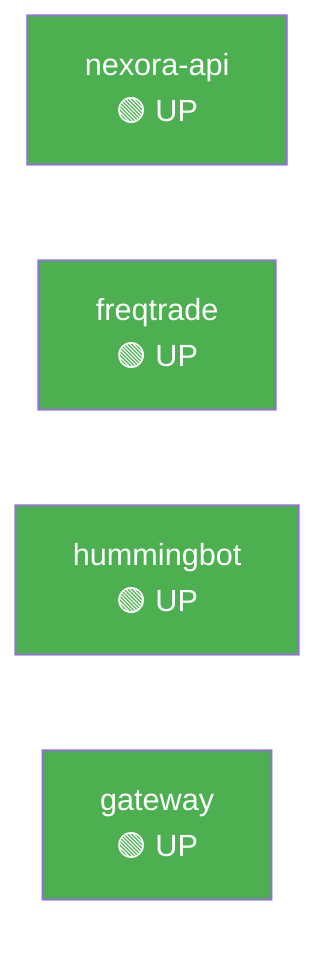
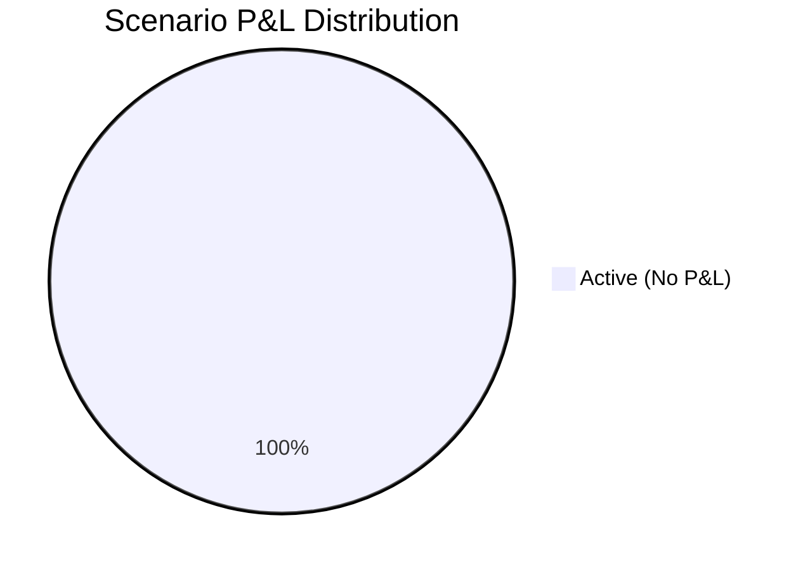

# 🏢 Executive Report
> Generated: 2026-02-26 06:03:50 UTC

## System Status

## Trading Performance

| Metric | Value | Status |
|--------|-------|--------|
| Total P&L | $0.00 | ⚪ |
| Win Rate | 0.0% | 🔴 |
| Profit Factor | 0.00 | 🔴 |
| Sharpe | 0.00 | 🔴 |
| Max Drawdown | 0.00% | 🟢 |
| Trades | 0 (0W/0L) | |

### Verdict: 🔴 OFF TRACK

## Active Scenarios

| Scenario | P&L | CEX | DEX | Status |
|----------|-----|-----|-----|--------|
| ⚪ momentum_lp | $0.00 | $0.00 | 🟢 Live | Active |
| ⚪ range_mm | $0.00 | $0.00 | 🟢 Live | Active |
| ⚪ cross_arb | $0.00 | $0.00 | 🟢 Live | Active |
| ⚪ hedged | $0.00 | $0.00 | 🟢 Live | Active |
| ⚪ funding_arb | $0.00 | $0.00 | 🟢 Live | Active |
| ⚪ token_snipe | $0.00 | $0.00 | 🟢 Live | Active |
| ⚪ flash_recovery | $0.00 | $0.00 | 🟢 Live | Active |
| ⚪ breakout_confirm | $0.00 | $0.00 | 🟢 Live | Active |
| ⚪ weekend_mm | $0.00 | $0.00 | 🟢 Live | Active |
