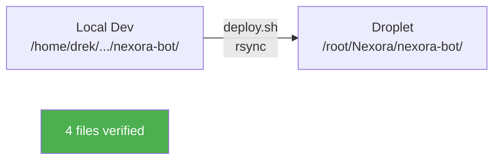

# 📊 Deployment & Sync Report
> Generated: 2026-02-26 06:03:52 UTC

## Code Sync Status

| File | MD5 | Status |
|------|-----|--------|
| `src/api/main.py` | `df185a762562` | ✅ Present |
| `src/connectors/freqtrade_client.py` | `70aa622b841b` | ✅ Present |
| `src/connectors/hummingbot_client.py` | `ec5635c5f75e` | ✅ Present |
| `src/core/scenarios.py` | `4c5325a96bde` | ✅ Present |

## Git Status

```
f1c4c06 ret
eaf2a8a docs: Update project status, audit findings, and implementation plans with new documentation, core scenarios, and API/orchestrator adjustments.
da7bca0 Progress
```

## Sync Flow



## Service Versions

- FreqTrade: `2026.1`
