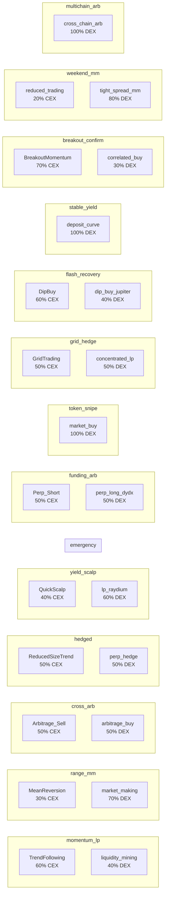

# 🛠 Scenario Execution Quality Report
> Generated: 2026-02-26 06:03:54 UTC

## Scenario Architecture (Designed)

## Designed vs Actual Allocations

| Scenario | Designed CEX | Designed DEX | Bot | DEX Status | Integrity |
|----------|-------------|-------------|-----|------------|-----------|
| momentum_lp | 60% | 40% | `nexora_momentum_lp` | 🟢 LIVE | ✅ LIVE |
| range_mm | 30% | 70% | `nexora_range_mm` | 🟢 LIVE | ✅ LIVE |
| cross_arb | 50% | 50% | `nexora_cross_arb` | 🟢 LIVE | ✅ LIVE |
| hedged | 50% | 50% | `nexora_hedged` | 🟢 LIVE | ✅ LIVE |
| yield_scalp | 40% | 60% | `nexora_yield_scalp` | 🔴 DOWN | 🔴 DOWN |
| emergency | 0% | 0% | — | ⚪ N/A | ✅ N/A |
| funding_arb | 50% | 50% | `nexora_funding_arb` | 🟢 LIVE | ✅ LIVE |
| token_snipe | 0% | 100% | `nexora_token_snipe` | 🟢 LIVE | ✅ LIVE |
| grid_hedge | 50% | 50% | `nexora_grid_hedge` | 🔴 DOWN | 🔴 DOWN |
| flash_recovery | 60% | 40% | `nexora_flash_recovery` | 🟢 LIVE | ✅ LIVE |
| stable_yield | 0% | 100% | `nexora_stable_yield` | 🔴 DOWN | 🔴 DOWN |
| breakout_confirm | 70% | 30% | `nexora_breakout` | 🟢 LIVE | ✅ LIVE |
| weekend_mm | 20% | 80% | `nexora_weekend_mm` | 🟢 LIVE | ✅ LIVE |
| multichain_arb | 0% | 100% | `nexora_multichain_arb` | 🔴 DOWN | 🔴 DOWN |

> ✅ **9** of 13 DEX scenarios LIVE. **0** pending Phase 4. 4 down/unreachable.

## Isolation Verification

| Scenario | CEX trade_id | CEX Status | DEX Bot | DEX Status | P&L |
|----------|-------------|------------|---------|------------|-----|
| momentum_lp | None | ❌ Missing | nexora_momentum_lp | 🟢 LIVE | $0.00 |
| range_mm | None | ❌ Missing | nexora_range_mm | 🟢 LIVE | $0.00 |
| cross_arb | None | ❌ Missing | nexora_cross_arb | 🟢 LIVE | $0.00 |
| hedged | None | ❌ Missing | nexora_hedged | 🟢 LIVE | $0.00 |
| yield_scalp | None | ❌ Missing | nexora_yield_scalp | 🔴 DOWN | $0.00 |
| emergency | — | ⚪ N/A | — | ⚪ N/A | $0.00 |
| funding_arb | None | ❌ Missing | nexora_funding_arb | 🟢 LIVE | $0.00 |
| token_snipe | — | ⚪ N/A | nexora_token_snipe | 🟢 LIVE | $0.00 |
| grid_hedge | None | ❌ Missing | nexora_grid_hedge | 🔴 DOWN | $0.00 |
| flash_recovery | None | ❌ Missing | nexora_flash_recovery | 🟢 LIVE | $0.00 |
| stable_yield | — | ⚪ N/A | nexora_stable_yield | 🔴 DOWN | $0.00 |
| breakout_confirm | None | ❌ Missing | nexora_breakout | 🟢 LIVE | $0.00 |
| weekend_mm | None | ❌ Missing | nexora_weekend_mm | 🟢 LIVE | $0.00 |
| multichain_arb | — | ⚪ N/A | nexora_multichain_arb | 🔴 DOWN | $0.00 |

## P&L Accuracy Audit

| Scenario | Stored | FreqTrade | Delta | Match? |
|----------|--------|-----------|-------|--------|
| momentum_lp | $0.00 | N/A | — | ⚠️ Trade closed/missing |
| range_mm | $0.00 | N/A | — | ⚠️ Trade closed/missing |
| cross_arb | $0.00 | N/A | — | ⚠️ Trade closed/missing |
| hedged | $0.00 | N/A | — | ⚠️ Trade closed/missing |
| yield_scalp | $0.00 | N/A | — | ⚠️ Trade closed/missing |
| emergency | $0.00 | N/A | — | ⚪ No CEX allocation |
| funding_arb | $0.00 | N/A | — | ⚠️ Trade closed/missing |
| token_snipe | $0.00 | N/A | — | ⚪ No CEX allocation |
| grid_hedge | $0.00 | N/A | — | ⚠️ Trade closed/missing |
| flash_recovery | $0.00 | N/A | — | ⚠️ Trade closed/missing |
| stable_yield | $0.00 | N/A | — | ⚪ No CEX allocation |
| breakout_confirm | $0.00 | N/A | — | ⚠️ Trade closed/missing |
| weekend_mm | $0.00 | N/A | — | ⚠️ Trade closed/missing |
| multichain_arb | $0.00 | N/A | — | ⚪ No CEX allocation |
