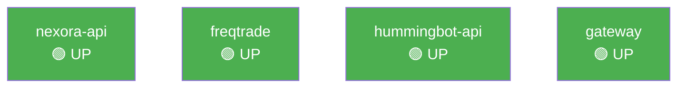

# 💻 Developer Technical Health Check
> Generated: 2026-02-26 06:03:55 UTC

## Phase 1: Infrastructure



## Phase 2: Resources

```
total        used        free      shared  buff/cache   available
Mem:           7.8Gi       4.6Gi       638Mi        25Mi       2.8Gi       3.1Gi
Filesystem      Size  Used Avail Use% Mounted on
/dev/vda1       154G   45G  110G  29% /
```

## Phase 3: Connectivity

| Service | Port | HTTP Status | Result |
|---------|------|-------------|--------|
| nexora-api | 8888 | 200 | ✅ |
| freqtrade | 8080 | 200 | ✅ |
| hummingbot | 8000 | 200 | ✅ |
| gateway | 15888 | 200 | ✅ |

## Phase 4: Recent Errors

```
ERROR:src.connectors.hummingbot_client:API request failed: GET http://127.0.0.1:8000/bot-orchestration//status - 404 Cli
ERROR:src.connectors.hummingbot_client:API request failed: GET http://127.0.0.1:8000/bot-orchestration//status - 404 Cli
ERROR:src.connectors.hummingbot_client:API request failed: GET http://127.0.0.1:8000/bot-orchestration//status - 404 Cli
ERROR:src.api.main:Failed to initialize database: permission denied for schema public
ERROR:asyncio:Unclosed client session
ERROR:src.api.main:Failed to initialize database: permission denied for schema public
ERROR:asyncio:Unclosed client session
ERROR:src.api.main:Failed to initialize database: permission denied for schema public
ERROR:asyncio:Unclosed client session
ERROR:    [Errno 98] error while attempting to bind on address ('0.0.0.0', 8888): address already in use
```
