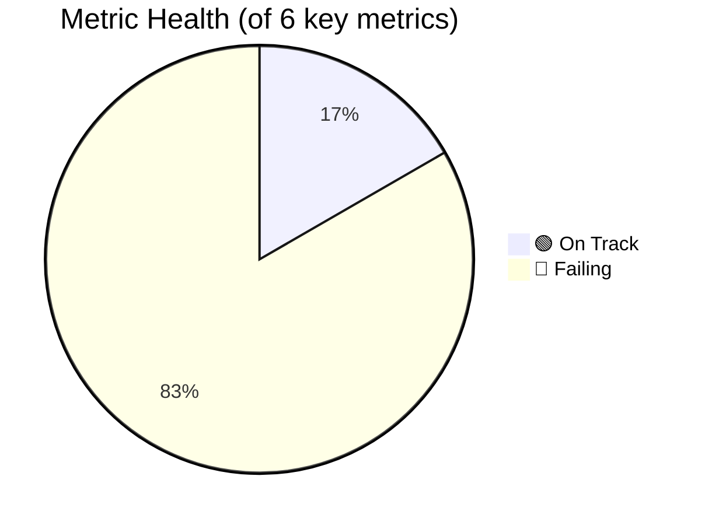

# 📈 Trading Pulse Check
> Generated: 2026-02-26 06:03:57 UTC

## Trading Mode

- Mode: **⚠️ PAPER TRADING**
- Strategy: `BreakoutMomentumV1`
- Timeframe: `1h`
- Stoploss: `-3.0%`
- Trailing Stop: `True`
- Max Open Trades: `3.0`

## Performance Metrics

| Metric | Value | Min Target | Status |
|--------|-------|------------|--------|
| Total P&L | $0.00 | > $0 | ⚪ |
| Closed P&L | $0.00 | > $0 | ⚪ |
| Win Rate | 0.0% | > 60% | 🔴 |
| Profit Factor | 0.00 | > 1.3 | 🔴 |
| Sharpe | 0.00 | > 1.0 | 🔴 |
| Sortino | 0.00 | > 1.5 | 🔴 |
| Max DD | 0.00% | < 5% | 🟢 |
| Expectancy | $0.0000/trade | > $0.30 | 🔴 |
| Avg Duration | 0:00:00 | 15m-4h | — |
| Trades | 0 (0W/0L) | — | — |
| Volume | $0.00 | — | — |

### Performance Gauge

### VERDICT: ⚪ IDLE — No trades executed

## Open Positions

No open trades

## Scenario Tracking

| Scenario | P&L | CEX | DEX | Status |
|----------|-----|-----|-----|--------|
| ⚪ momentum_lp | $0.00 | $0.00 | 🟢 Live | Active |
| ⚪ range_mm | $0.00 | $0.00 | 🟢 Live | Active |
| ⚪ cross_arb | $0.00 | $0.00 | 🟢 Live | Active |
| ⚪ hedged | $0.00 | $0.00 | 🟢 Live | Active |
| ⚪ yield_scalp | $0.00 | $0.00 | 🔴 Down/Dead | Idle |
| ⚪ emergency | $0.00 | $0.00 | ⚪ N/A | Idle |
| ⚪ funding_arb | $0.00 | $0.00 | 🟢 Live | Active |
| ⚪ token_snipe | $0.00 | $0.00 | 🟢 Live | Active |
| ⚪ grid_hedge | $0.00 | $0.00 | 🔴 Down/Dead | Idle |
| ⚪ flash_recovery | $0.00 | $0.00 | 🟢 Live | Active |
| ⚪ stable_yield | $0.00 | $0.00 | 🔴 Down/Dead | Idle |
| ⚪ breakout_confirm | $0.00 | $0.00 | 🟢 Live | Active |
| ⚪ weekend_mm | $0.00 | $0.00 | 🟢 Live | Active |
| ⚪ multichain_arb | $0.00 | $0.00 | 🔴 Down/Dead | Idle |

## 🏗 DEX System Integrity

🟢 **9** bot(s) active
> Detected: ['nexora_breakout', 'nexora_cross_arb', 'nexora_flash_recovery', 'nexora_funding_arb', 'nexora_hedged', 'nexora_momentum_lp', 'nexora_range_mm', 'nexora_token_snipe', 'nexora_weekend_mm']

## Balance

**Total: 1000.00 USDT**

| Currency | Balance | Free |
|----------|---------|------|
| USDT | 1000.0000 | 1000.0000 |
