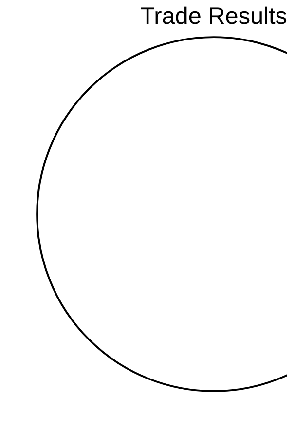

# 📊 Daily Trading Report
> Generated: 2026-02-26 06:03:59 UTC

## Trade Summary

- **Closed Trades**: 0
- **Total P&L**: $0.00
- **Record**: 0W / 0L
- **Avg Win**: $0.00 | **Avg Loss**: $0.00

## Recent Trades (Last 10)

| # | Pair | P&L | % | Open | Close |
|---|------|-----|---|------|-------|

## P&L by Pair

| Pair | Trades | P&L | Avg |
|------|--------|-----|-----|

## Hummingbot DEX Status

- 🟢 **nexora_funding_arb**: {'status': 'stopped', 'performance': {}, 'error_logs': [], 'general_logs': [], 'recently_active': True, 'source': 'docker'}
- 🟢 **nexora_cross_arb**: {'status': 'stopped', 'performance': {}, 'error_logs': [], 'general_logs': [], 'recently_active': True, 'source': 'docker'}
- 🟢 **nexora_token_snipe**: {'status': 'stopped', 'performance': {}, 'error_logs': [], 'general_logs': [{'level_name': 'WARNING', 'msg': 'The websocket connection was closed (The WS connection was closed unexpectedly. Close code = 1006 msg data: None)', 'timestamp': 1772077500.3694777, 'level_no': 30, 'logger_name': 'hummingbot.connector.exchange.binance.binance_api_order_book_data_source.BinanceAPIOrderBookDataSource'}, {'level_name': 'INFO', 'msg': 'Subscribed to public order book and trade channels...', 'timestamp': 1772077500.8585477, 'level_no': 20, 'logger_name': 'hummingbot.connector.exchange.binance.binance_api_order_book_data_source.BinanceAPIOrderBookDataSource'}], 'recently_active': True, 'source': 'docker'}
- 🟢 **nexora_momentum_lp**: {'status': 'stopped', 'performance': {}, 'error_logs': [], 'general_logs': [], 'recently_active': True, 'source': 'docker'}
- 🟢 **nexora_range_mm-20260224-190302**: {'status': 'stopped', 'performance': {}, 'error_logs': [], 'general_logs': [], 'recently_active': True, 'source': 'docker'}
- 🟢 **nexora_weekend_mm-20260224-190321**: {'status': 'stopped', 'performance': {}, 'error_logs': [], 'general_logs': [], 'recently_active': True, 'source': 'docker'}
- 🟢 **nexora_hedged**: {'status': 'stopped', 'performance': {}, 'error_logs': [{'level_name': 'ERROR', 'msg': 'MQTT Gateway failed to reconnect: cannot schedule new futures after shutdown. Sleeping 10 seconds before retry.', 'timestamp': 1772081348.4677725, 'level_no': 40, 'logger_name': 'hummingbot.client.hummingbot_application'}, {'level_name': 'ERROR', 'msg': 'MQTT Gateway failed to reconnect: . Sleeping 10 seconds before retry.', 'timestamp': 1772081363.4796975, 'level_no': 40, 'logger_name': 'hummingbot.client.hummingbot_application'}, {'level_name': 'ERROR', 'msg': 'MQTT Gateway failed to reconnect: cannot schedule new futures after shutdown. Sleeping 10 seconds before retry.', 'timestamp': 1772081438.8560917, 'level_no': 40, 'logger_name': 'hummingbot.client.hummingbot_application'}, {'level_name': 'ERROR', 'msg': 'MQTT Gateway failed to reconnect: . Sleeping 10 seconds before retry.', 'timestamp': 1772081458.8858993, 'level_no': 40, 'logger_name': 'hummingbot.client.hummingbot_application'}, {'level_name': 'ERROR', 'msg': 'MQTT Gateway failed to reconnect: cannot schedule new futures after shutdown. Sleeping 10 seconds before retry.', 'timestamp': 1772081534.450869, 'level_no': 40, 'logger_name': 'hummingbot.client.hummingbot_application'}, {'level_name': 'ERROR', 'msg': 'MQTT Gateway failed to reconnect: . Sleeping 10 seconds before retry.', 'timestamp': 1772081549.473566, 'level_no': 40, 'logger_name': 'hummingbot.client.hummingbot_application'}, {'level_name': 'ERROR', 'msg': 'MQTT Gateway failed to reconnect: cannot schedule new futures after shutdown. Sleeping 10 seconds before retry.', 'timestamp': 1772081624.9918506, 'level_no': 40, 'logger_name': 'hummingbot.client.hummingbot_application'}, {'level_name': 'ERROR', 'msg': 'MQTT Gateway failed to reconnect: . Sleeping 10 seconds before retry.', 'timestamp': 1772081645.0258791, 'level_no': 40, 'logger_name': 'hummingbot.client.hummingbot_application'}, {'level_name': 'ERROR', 'msg': 'MQTT Gateway failed to reconnect: cannot schedule new futures after shutdown. Sleeping 10 seconds before retry.', 'timestamp': 1772081720.4766428, 'level_no': 40, 'logger_name': 'hummingbot.client.hummingbot_application'}, {'level_name': 'ERROR', 'msg': 'MQTT Gateway failed to reconnect: . Sleeping 10 seconds before retry.', 'timestamp': 1772081735.493851, 'level_no': 40, 'logger_name': 'hummingbot.client.hummingbot_application'}, {'level_name': 'ERROR', 'msg': 'MQTT Gateway failed to reconnect: cannot schedule new futures after shutdown. Sleeping 10 seconds before retry.', 'timestamp': 1772081811.0016232, 'level_no': 40, 'logger_name': 'hummingbot.client.hummingbot_application'}, {'level_name': 'ERROR', 'msg': 'MQTT Gateway failed to reconnect: . Sleeping 10 seconds before retry.', 'timestamp': 1772081826.0165415, 'level_no': 40, 'logger_name': 'hummingbot.client.hummingbot_application'}, {'level_name': 'ERROR', 'msg': 'MQTT Gateway failed to reconnect: cannot schedule new futures after shutdown. Sleeping 10 seconds before retry.', 'timestamp': 1772081901.360579, 'level_no': 40, 'logger_name': 'hummingbot.client.hummingbot_application'}, {'level_name': 'ERROR', 'msg': 'MQTT Gateway failed to reconnect: . Sleeping 10 seconds before retry.', 'timestamp': 1772081916.3679783, 'level_no': 40, 'logger_name': 'hummingbot.client.hummingbot_application'}, {'level_name': 'ERROR', 'msg': 'MQTT Gateway failed to reconnect: cannot schedule new futures after shutdown. Sleeping 10 seconds before retry.', 'timestamp': 1772081991.7910674, 'level_no': 40, 'logger_name': 'hummingbot.client.hummingbot_application'}, {'level_name': 'ERROR', 'msg': 'MQTT Gateway failed to reconnect: . Sleeping 10 seconds before retry.', 'timestamp': 1772082006.813713, 'level_no': 40, 'logger_name': 'hummingbot.client.hummingbot_application'}, {'level_name': 'ERROR', 'msg': 'MQTT Gateway failed to reconnect: cannot schedule new futures after shutdown. Sleeping 10 seconds before retry.', 'timestamp': 1772082082.4337008, 'level_no': 40, 'logger_name': 'hummingbot.client.hummingbot_application'}, {'level_name': 'ERROR', 'msg': 'MQTT Gateway failed to reconnect: . Sleeping 10 seconds before retry.', 'timestamp': 1772082097.4473403, 'level_no': 40, 'logger_name': 'hummingbot.client.hummingbot_application'}, {'level_name': 'ERROR', 'msg': 'MQTT Gateway failed to reconnect: cannot schedule new futures after shutdown. Sleeping 10 seconds before retry.', 'timestamp': 1772082172.7930949, 'level_no': 40, 'logger_name': 'hummingbot.client.hummingbot_application'}, {'level_name': 'ERROR', 'msg': 'MQTT Gateway failed to reconnect: . Sleeping 10 seconds before retry.', 'timestamp': 1772082187.8090904, 'level_no': 40, 'logger_name': 'hummingbot.client.hummingbot_application'}, {'level_name': 'ERROR', 'msg': 'MQTT Gateway failed to reconnect: cannot schedule new futures after shutdown. Sleeping 10 seconds before retry.', 'timestamp': 1772082263.234593, 'level_no': 40, 'logger_name': 'hummingbot.client.hummingbot_application'}, {'level_name': 'ERROR', 'msg': 'MQTT Gateway failed to reconnect: . Sleeping 10 seconds before retry.', 'timestamp': 1772082278.2455432, 'level_no': 40, 'logger_name': 'hummingbot.client.hummingbot_application'}, {'level_name': 'ERROR', 'msg': 'MQTT Gateway failed to reconnect: cannot schedule new futures after shutdown. Sleeping 10 seconds before retry.', 'timestamp': 1772082353.6431131, 'level_no': 40, 'logger_name': 'hummingbot.client.hummingbot_application'}, {'level_name': 'ERROR', 'msg': 'MQTT Gateway failed to reconnect: . Sleeping 10 seconds before retry.', 'timestamp': 1772082368.6509583, 'level_no': 40, 'logger_name': 'hummingbot.client.hummingbot_application'}, {'level_name': 'ERROR', 'msg': 'MQTT Gateway failed to reconnect: cannot schedule new futures after shutdown. Sleeping 10 seconds before retry.', 'timestamp': 1772082444.2474053, 'level_no': 40, 'logger_name': 'hummingbot.client.hummingbot_application'}, {'level_name': 'ERROR', 'msg': 'MQTT Gateway failed to reconnect: . Sleeping 10 seconds before retry.', 'timestamp': 1772082459.2627296, 'level_no': 40, 'logger_name': 'hummingbot.client.hummingbot_application'}, {'level_name': 'ERROR', 'msg': 'MQTT Gateway failed to reconnect: cannot schedule new futures after shutdown. Sleeping 10 seconds before retry.', 'timestamp': 1772082534.61902, 'level_no': 40, 'logger_name': 'hummingbot.client.hummingbot_application'}, {'level_name': 'ERROR', 'msg': 'MQTT Gateway failed to reconnect: . Sleeping 10 seconds before retry.', 'timestamp': 1772082549.6358466, 'level_no': 40, 'logger_name': 'hummingbot.client.hummingbot_application'}, {'level_name': 'ERROR', 'msg': 'MQTT Gateway failed to reconnect: cannot schedule new futures after shutdown. Sleeping 10 seconds before retry.', 'timestamp': 1772082625.1207232, 'level_no': 40, 'logger_name': 'hummingbot.client.hummingbot_application'}, {'level_name': 'ERROR', 'msg': 'MQTT Gateway failed to reconnect: . Sleeping 10 seconds before retry.', 'timestamp': 1772082640.1398175, 'level_no': 40, 'logger_name': 'hummingbot.client.hummingbot_application'}, {'level_name': 'ERROR', 'msg': 'MQTT Gateway failed to reconnect: cannot schedule new futures after shutdown. Sleeping 10 seconds before retry.', 'timestamp': 1772082715.5578802, 'level_no': 40, 'logger_name': 'hummingbot.client.hummingbot_application'}, {'level_name': 'ERROR', 'msg': 'MQTT Gateway failed to reconnect: . Sleeping 10 seconds before retry.', 'timestamp': 1772082730.5723827, 'level_no': 40, 'logger_name': 'hummingbot.client.hummingbot_application'}, {'level_name': 'ERROR', 'msg': 'MQTT Gateway failed to reconnect: cannot schedule new futures after shutdown. Sleeping 10 seconds before retry.', 'timestamp': 1772082805.901649, 'level_no': 40, 'logger_name': 'hummingbot.client.hummingbot_application'}, {'level_name': 'ERROR', 'msg': 'MQTT Gateway failed to reconnect: . Sleeping 10 seconds before retry.', 'timestamp': 1772082820.9228065, 'level_no': 40, 'logger_name': 'hummingbot.client.hummingbot_application'}, {'level_name': 'ERROR', 'msg': 'MQTT Gateway failed to reconnect: cannot schedule new futures after shutdown. Sleeping 10 seconds before retry.', 'timestamp': 1772082896.316818, 'level_no': 40, 'logger_name': 'hummingbot.client.hummingbot_application'}, {'level_name': 'ERROR', 'msg': 'MQTT Gateway failed to reconnect: . Sleeping 10 seconds before retry.', 'timestamp': 1772082911.3336775, 'level_no': 40, 'logger_name': 'hummingbot.client.hummingbot_application'}, {'level_name': 'ERROR', 'msg': 'MQTT Gateway failed to reconnect: cannot schedule new futures after shutdown. Sleeping 10 seconds before retry.', 'timestamp': 1772082987.254885, 'level_no': 40, 'logger_name': 'hummingbot.client.hummingbot_application'}, {'level_name': 'ERROR', 'msg': 'MQTT Gateway failed to reconnect: . Sleeping 10 seconds before retry.', 'timestamp': 1772083002.2820835, 'level_no': 40, 'logger_name': 'hummingbot.client.hummingbot_application'}, {'level_name': 'ERROR', 'msg': 'MQTT Gateway failed to reconnect: cannot schedule new futures after shutdown. Sleeping 10 seconds before retry.', 'timestamp': 1772083078.1192217, 'level_no': 40, 'logger_name': 'hummingbot.client.hummingbot_application'}, {'level_name': 'ERROR', 'msg': 'MQTT Gateway failed to reconnect: . Sleeping 10 seconds before retry.', 'timestamp': 1772083093.1449409, 'level_no': 40, 'logger_name': 'hummingbot.client.hummingbot_application'}, {'level_name': 'ERROR', 'msg': 'MQTT Gateway failed to reconnect: cannot schedule new futures after shutdown. Sleeping 10 seconds before retry.', 'timestamp': 1772083169.0830586, 'level_no': 40, 'logger_name': 'hummingbot.client.hummingbot_application'}, {'level_name': 'ERROR', 'msg': 'MQTT Gateway failed to reconnect: . Sleeping 10 seconds before retry.', 'timestamp': 1772083184.1018317, 'level_no': 40, 'logger_name': 'hummingbot.client.hummingbot_application'}, {'level_name': 'ERROR', 'msg': 'MQTT Gateway failed to reconnect: cannot schedule new futures after shutdown. Sleeping 10 seconds before retry.', 'timestamp': 1772083260.2264256, 'level_no': 40, 'logger_name': 'hummingbot.client.hummingbot_application'}, {'level_name': 'ERROR', 'msg': 'MQTT Gateway failed to reconnect: . Sleeping 10 seconds before retry.', 'timestamp': 1772083275.2542405, 'level_no': 40, 'logger_name': 'hummingbot.client.hummingbot_application'}, {'level_name': 'ERROR', 'msg': 'MQTT Gateway failed to reconnect: cannot schedule new futures after shutdown. Sleeping 10 seconds before retry.', 'timestamp': 1772083351.3748777, 'level_no': 40, 'logger_name': 'hummingbot.client.hummingbot_application'}, {'level_name': 'ERROR', 'msg': 'MQTT Gateway failed to reconnect: . Sleeping 10 seconds before retry.', 'timestamp': 1772083366.3983357, 'level_no': 40, 'logger_name': 'hummingbot.client.hummingbot_application'}, {'level_name': 'ERROR', 'msg': 'MQTT Gateway failed to reconnect: cannot schedule new futures after shutdown. Sleeping 10 seconds before retry.', 'timestamp': 1772083442.2267709, 'level_no': 40, 'logger_name': 'hummingbot.client.hummingbot_application'}, {'level_name': 'ERROR', 'msg': 'MQTT Gateway failed to reconnect: . Sleeping 10 seconds before retry.', 'timestamp': 1772083457.2494156, 'level_no': 40, 'logger_name': 'hummingbot.client.hummingbot_application'}, {'level_name': 'ERROR', 'msg': 'MQTT Gateway failed to reconnect: cannot schedule new futures after shutdown. Sleeping 10 seconds before retry.', 'timestamp': 1772083533.0566916, 'level_no': 40, 'logger_name': 'hummingbot.client.hummingbot_application'}, {'level_name': 'ERROR', 'msg': 'MQTT Gateway failed to reconnect: . Sleeping 10 seconds before retry.', 'timestamp': 1772083548.0908017, 'level_no': 40, 'logger_name': 'hummingbot.client.hummingbot_application'}, {'level_name': 'ERROR', 'msg': 'MQTT Gateway failed to reconnect: cannot schedule new futures after shutdown. Sleeping 10 seconds before retry.', 'timestamp': 1772083623.9574378, 'level_no': 40, 'logger_name': 'hummingbot.client.hummingbot_application'}, {'level_name': 'ERROR', 'msg': 'MQTT Gateway failed to reconnect: . Sleeping 10 seconds before retry.', 'timestamp': 1772083638.9752162, 'level_no': 40, 'logger_name': 'hummingbot.client.hummingbot_application'}, {'level_name': 'ERROR', 'msg': 'MQTT Gateway failed to reconnect: cannot schedule new futures after shutdown. Sleeping 10 seconds before retry.', 'timestamp': 1772083714.968419, 'level_no': 40, 'logger_name': 'hummingbot.client.hummingbot_application'}, {'level_name': 'ERROR', 'msg': 'MQTT Gateway failed to reconnect: . Sleeping 10 seconds before retry.', 'timestamp': 1772083730.0184197, 'level_no': 40, 'logger_name': 'hummingbot.client.hummingbot_application'}, {'level_name': 'ERROR', 'msg': 'MQTT Gateway failed to reconnect: cannot schedule new futures after shutdown. Sleeping 10 seconds before retry.', 'timestamp': 1772083806.0250542, 'level_no': 40, 'logger_name': 'hummingbot.client.hummingbot_application'}, {'level_name': 'ERROR', 'msg': 'MQTT Gateway failed to reconnect: . Sleeping 10 seconds before retry.', 'timestamp': 1772083821.0492463, 'level_no': 40, 'logger_name': 'hummingbot.client.hummingbot_application'}, {'level_name': 'ERROR', 'msg': 'MQTT Gateway failed to reconnect: cannot schedule new futures after shutdown. Sleeping 10 seconds before retry.', 'timestamp': 1772083896.8277438, 'level_no': 40, 'logger_name': 'hummingbot.client.hummingbot_application'}, {'level_name': 'ERROR', 'msg': 'MQTT Gateway failed to reconnect: . Sleeping 10 seconds before retry.', 'timestamp': 1772083911.8486366, 'level_no': 40, 'logger_name': 'hummingbot.client.hummingbot_application'}, {'level_name': 'ERROR', 'msg': 'MQTT Gateway failed to reconnect: cannot schedule new futures after shutdown. Sleeping 10 seconds before retry.', 'timestamp': 1772083987.5539322, 'level_no': 40, 'logger_name': 'hummingbot.client.hummingbot_application'}, {'level_name': 'ERROR', 'msg': 'MQTT Gateway failed to reconnect: . Sleeping 10 seconds before retry.', 'timestamp': 1772084002.5738666, 'level_no': 40, 'logger_name': 'hummingbot.client.hummingbot_application'}, {'level_name': 'ERROR', 'msg': 'MQTT Gateway failed to reconnect: cannot schedule new futures after shutdown. Sleeping 10 seconds before retry.', 'timestamp': 1772084078.3480785, 'level_no': 40, 'logger_name': 'hummingbot.client.hummingbot_application'}, {'level_name': 'ERROR', 'msg': 'MQTT Gateway failed to reconnect: . Sleeping 10 seconds before retry.', 'timestamp': 1772084093.38883, 'level_no': 40, 'logger_name': 'hummingbot.client.hummingbot_application'}, {'level_name': 'ERROR', 'msg': 'MQTT Gateway failed to reconnect: cannot schedule new futures after shutdown. Sleeping 10 seconds before retry.', 'timestamp': 1772084168.9598238, 'level_no': 40, 'logger_name': 'hummingbot.client.hummingbot_application'}, {'level_name': 'ERROR', 'msg': 'MQTT Gateway failed to reconnect: . Sleeping 10 seconds before retry.', 'timestamp': 1772084188.9785702, 'level_no': 40, 'logger_name': 'hummingbot.client.hummingbot_application'}, {'level_name': 'ERROR', 'msg': 'MQTT Gateway failed to reconnect: cannot schedule new futures after shutdown. Sleeping 10 seconds before retry.', 'timestamp': 1772084264.428438, 'level_no': 40, 'logger_name': 'hummingbot.client.hummingbot_application'}, {'level_name': 'ERROR', 'msg': 'MQTT Gateway failed to reconnect: . Sleeping 10 seconds before retry.', 'timestamp': 1772084279.4437702, 'level_no': 40, 'logger_name': 'hummingbot.client.hummingbot_application'}, {'level_name': 'ERROR', 'msg': 'MQTT Gateway failed to reconnect: cannot schedule new futures after shutdown. Sleeping 10 seconds before retry.', 'timestamp': 1772084354.8487449, 'level_no': 40, 'logger_name': 'hummingbot.client.hummingbot_application'}, {'level_name': 'ERROR', 'msg': 'MQTT Gateway failed to reconnect: . Sleeping 10 seconds before retry.', 'timestamp': 1772084369.8650944, 'level_no': 40, 'logger_name': 'hummingbot.client.hummingbot_application'}, {'level_name': 'ERROR', 'msg': 'MQTT Gateway failed to reconnect: cannot schedule new futures after shutdown. Sleeping 10 seconds before retry.', 'timestamp': 1772084445.3571444, 'level_no': 40, 'logger_name': 'hummingbot.client.hummingbot_application'}, {'level_name': 'ERROR', 'msg': 'MQTT Gateway failed to reconnect: . Sleeping 10 seconds before retry.', 'timestamp': 1772084460.3646932, 'level_no': 40, 'logger_name': 'hummingbot.client.hummingbot_application'}, {'level_name': 'ERROR', 'msg': 'MQTT Gateway failed to reconnect: cannot schedule new futures after shutdown. Sleeping 10 seconds before retry.', 'timestamp': 1772084535.8891065, 'level_no': 40, 'logger_name': 'hummingbot.client.hummingbot_application'}, {'level_name': 'ERROR', 'msg': 'MQTT Gateway failed to reconnect: . Sleeping 10 seconds before retry.', 'timestamp': 1772084550.9048605, 'level_no': 40, 'logger_name': 'hummingbot.client.hummingbot_application'}, {'level_name': 'ERROR', 'msg': 'MQTT Gateway failed to reconnect: cannot schedule new futures after shutdown. Sleeping 10 seconds before retry.', 'timestamp': 1772084626.5221758, 'level_no': 40, 'logger_name': 'hummingbot.client.hummingbot_application'}, {'level_name': 'ERROR', 'msg': 'MQTT Gateway failed to reconnect: . Sleeping 10 seconds before retry.', 'timestamp': 1772084641.536051, 'level_no': 40, 'logger_name': 'hummingbot.client.hummingbot_application'}, {'level_name': 'ERROR', 'msg': 'MQTT Gateway failed to reconnect: cannot schedule new futures after shutdown. Sleeping 10 seconds before retry.', 'timestamp': 1772084716.8838015, 'level_no': 40, 'logger_name': 'hummingbot.client.hummingbot_application'}, {'level_name': 'ERROR', 'msg': 'MQTT Gateway failed to reconnect: . Sleeping 10 seconds before retry.', 'timestamp': 1772084736.9032416, 'level_no': 40, 'logger_name': 'hummingbot.client.hummingbot_application'}, {'level_name': 'ERROR', 'msg': 'MQTT Gateway failed to reconnect: cannot schedule new futures after shutdown. Sleeping 10 seconds before retry.', 'timestamp': 1772084812.2675164, 'level_no': 40, 'logger_name': 'hummingbot.client.hummingbot_application'}, {'level_name': 'ERROR', 'msg': 'MQTT Gateway failed to reconnect: . Sleeping 10 seconds before retry.', 'timestamp': 1772084827.2767355, 'level_no': 40, 'logger_name': 'hummingbot.client.hummingbot_application'}, {'level_name': 'ERROR', 'msg': 'MQTT Gateway failed to reconnect: cannot schedule new futures after shutdown. Sleeping 10 seconds before retry.', 'timestamp': 1772084902.5832448, 'level_no': 40, 'logger_name': 'hummingbot.client.hummingbot_application'}, {'level_name': 'ERROR', 'msg': 'MQTT Gateway failed to reconnect: . Sleeping 10 seconds before retry.', 'timestamp': 1772084917.5985615, 'level_no': 40, 'logger_name': 'hummingbot.client.hummingbot_application'}, {'level_name': 'ERROR', 'msg': 'MQTT Gateway failed to reconnect: cannot schedule new futures after shutdown. Sleeping 10 seconds before retry.', 'timestamp': 1772084993.0365188, 'level_no': 40, 'logger_name': 'hummingbot.client.hummingbot_application'}, {'level_name': 'ERROR', 'msg': 'MQTT Gateway failed to reconnect: . Sleeping 10 seconds before retry.', 'timestamp': 1772085008.0480034, 'level_no': 40, 'logger_name': 'hummingbot.client.hummingbot_application'}, {'level_name': 'ERROR', 'msg': 'MQTT Gateway failed to reconnect: cannot schedule new futures after shutdown. Sleeping 10 seconds before retry.', 'timestamp': 1772085083.4984677, 'level_no': 40, 'logger_name': 'hummingbot.client.hummingbot_application'}, {'level_name': 'ERROR', 'msg': 'MQTT Gateway failed to reconnect: . Sleeping 10 seconds before retry.', 'timestamp': 1772085098.5214815, 'level_no': 40, 'logger_name': 'hummingbot.client.hummingbot_application'}, {'level_name': 'ERROR', 'msg': 'MQTT Gateway failed to reconnect: cannot schedule new futures after shutdown. Sleeping 10 seconds before retry.', 'timestamp': 1772085173.9998646, 'level_no': 40, 'logger_name': 'hummingbot.client.hummingbot_application'}, {'level_name': 'ERROR', 'msg': 'MQTT Gateway failed to reconnect: . Sleeping 10 seconds before retry.', 'timestamp': 1772085189.019305, 'level_no': 40, 'logger_name': 'hummingbot.client.hummingbot_application'}, {'level_name': 'ERROR', 'msg': 'MQTT Gateway failed to reconnect: cannot schedule new futures after shutdown. Sleeping 10 seconds before retry.', 'timestamp': 1772085264.6273472, 'level_no': 40, 'logger_name': 'hummingbot.client.hummingbot_application'}, {'level_name': 'ERROR', 'msg': 'MQTT Gateway failed to reconnect: . Sleeping 10 seconds before retry.', 'timestamp': 1772085279.6406186, 'level_no': 40, 'logger_name': 'hummingbot.client.hummingbot_application'}, {'level_name': 'ERROR', 'msg': 'MQTT Gateway failed to reconnect: cannot schedule new futures after shutdown. Sleeping 10 seconds before retry.', 'timestamp': 1772085355.2762582, 'level_no': 40, 'logger_name': 'hummingbot.client.hummingbot_application'}, {'level_name': 'ERROR', 'msg': 'MQTT Gateway failed to reconnect: . Sleeping 10 seconds before retry.', 'timestamp': 1772085370.3029718, 'level_no': 40, 'logger_name': 'hummingbot.client.hummingbot_application'}, {'level_name': 'ERROR', 'msg': 'MQTT Gateway failed to reconnect: cannot schedule new futures after shutdown. Sleeping 10 seconds before retry.', 'timestamp': 1772085445.72826, 'level_no': 40, 'logger_name': 'hummingbot.client.hummingbot_application'}, {'level_name': 'ERROR', 'msg': 'MQTT Gateway failed to reconnect: . Sleeping 10 seconds before retry.', 'timestamp': 1772085460.7439651, 'level_no': 40, 'logger_name': 'hummingbot.client.hummingbot_application'}, {'level_name': 'ERROR', 'msg': 'MQTT Gateway failed to reconnect: cannot schedule new futures after shutdown. Sleeping 10 seconds before retry.', 'timestamp': 1772085536.1779454, 'level_no': 40, 'logger_name': 'hummingbot.client.hummingbot_application'}, {'level_name': 'ERROR', 'msg': 'MQTT Gateway failed to reconnect: . Sleeping 10 seconds before retry.', 'timestamp': 1772085551.1913133, 'level_no': 40, 'logger_name': 'hummingbot.client.hummingbot_application'}, {'level_name': 'ERROR', 'msg': 'MQTT Gateway failed to reconnect: cannot schedule new futures after shutdown. Sleeping 10 seconds before retry.', 'timestamp': 1772085626.754601, 'level_no': 40, 'logger_name': 'hummingbot.client.hummingbot_application'}, {'level_name': 'ERROR', 'msg': 'MQTT Gateway failed to reconnect: . Sleeping 10 seconds before retry.', 'timestamp': 1772085641.7628603, 'level_no': 40, 'logger_name': 'hummingbot.client.hummingbot_application'}, {'level_name': 'ERROR', 'msg': 'MQTT Gateway failed to reconnect: cannot schedule new futures after shutdown. Sleeping 10 seconds before retry.', 'timestamp': 1772085717.3726773, 'level_no': 40, 'logger_name': 'hummingbot.client.hummingbot_application'}, {'level_name': 'ERROR', 'msg': 'MQTT Gateway failed to reconnect: . Sleeping 10 seconds before retry.', 'timestamp': 1772085732.3918874, 'level_no': 40, 'logger_name': 'hummingbot.client.hummingbot_application'}, {'level_name': 'ERROR', 'msg': 'MQTT Gateway failed to reconnect: cannot schedule new futures after shutdown. Sleeping 10 seconds before retry.', 'timestamp': 1772085808.3079243, 'level_no': 40, 'logger_name': 'hummingbot.client.hummingbot_application'}, {'level_name': 'ERROR', 'msg': 'MQTT Gateway failed to reconnect: . Sleeping 10 seconds before retry.', 'timestamp': 1772085823.3287508, 'level_no': 40, 'logger_name': 'hummingbot.client.hummingbot_application'}], 'general_logs': [{'level_name': 'WARNING', 'msg': 'MQTT Gateway is disconnected, attempting to reconnect.', 'timestamp': 1772081358.4732413, 'level_no': 30, 'logger_name': 'hummingbot.client.hummingbot_application'}, {'level_name': 'WARNING', 'msg': 'MQTT Gateway is disconnected, attempting to reconnect.', 'timestamp': 1772081373.483724, 'level_no': 30, 'logger_name': 'hummingbot.client.hummingbot_application'}, {'level_name': 'WARNING', 'msg': 'MQTT Gateway is disconnected, attempting to reconnect.', 'timestamp': 1772081448.8592663, 'level_no': 30, 'logger_name': 'hummingbot.client.hummingbot_application'}, {'level_name': 'WARNING', 'msg': 'MQTT Gateway is disconnected, attempting to reconnect.', 'timestamp': 1772081468.8949258, 'level_no': 30, 'logger_name': 'hummingbot.client.hummingbot_application'}, {'level_name': 'WARNING', 'msg': 'MQTT Gateway is disconnected, attempting to reconnect.', 'timestamp': 1772081544.4642274, 'level_no': 30, 'logger_name': 'hummingbot.client.hummingbot_application'}, {'level_name': 'WARNING', 'msg': 'MQTT Gateway is disconnected, attempting to reconnect.', 'timestamp': 1772081559.477566, 'level_no': 30, 'logger_name': 'hummingbot.client.hummingbot_application'}, {'level_name': 'WARNING', 'msg': 'MQTT Gateway is disconnected, attempting to reconnect.', 'timestamp': 1772081635.000497, 'level_no': 30, 'logger_name': 'hummingbot.client.hummingbot_application'}, {'level_name': 'WARNING', 'msg': 'MQTT Gateway is disconnected, attempting to reconnect.', 'timestamp': 1772081655.0372226, 'level_no': 30, 'logger_name': 'hummingbot.client.hummingbot_application'}, {'level_name': 'WARNING', 'msg': 'MQTT Gateway is disconnected, attempting to reconnect.', 'timestamp': 1772081730.480868, 'level_no': 30, 'logger_name': 'hummingbot.client.hummingbot_application'}, {'level_name': 'WARNING', 'msg': 'MQTT Gateway is disconnected, attempting to reconnect.', 'timestamp': 1772081745.4962037, 'level_no': 30, 'logger_name': 'hummingbot.client.hummingbot_application'}, {'level_name': 'WARNING', 'msg': 'MQTT Gateway is disconnected, attempting to reconnect.', 'timestamp': 1772081821.009219, 'level_no': 30, 'logger_name': 'hummingbot.client.hummingbot_application'}, {'level_name': 'WARNING', 'msg': 'MQTT Gateway is disconnected, attempting to reconnect.', 'timestamp': 1772081836.0255895, 'level_no': 30, 'logger_name': 'hummingbot.client.hummingbot_application'}, {'level_name': 'WARNING', 'msg': 'MQTT Gateway is disconnected, attempting to reconnect.', 'timestamp': 1772081911.3636987, 'level_no': 30, 'logger_name': 'hummingbot.client.hummingbot_application'}, {'level_name': 'WARNING', 'msg': 'MQTT Gateway is disconnected, attempting to reconnect.', 'timestamp': 1772081926.3737328, 'level_no': 30, 'logger_name': 'hummingbot.client.hummingbot_application'}, {'level_name': 'WARNING', 'msg': 'MQTT Gateway is disconnected, attempting to reconnect.', 'timestamp': 1772082001.805645, 'level_no': 30, 'logger_name': 'hummingbot.client.hummingbot_application'}, {'level_name': 'WARNING', 'msg': 'MQTT Gateway is disconnected, attempting to reconnect.', 'timestamp': 1772082016.8210645, 'level_no': 30, 'logger_name': 'hummingbot.client.hummingbot_application'}, {'level_name': 'WARNING', 'msg': 'MQTT Gateway is disconnected, attempting to reconnect.', 'timestamp': 1772082092.4350648, 'level_no': 30, 'logger_name': 'hummingbot.client.hummingbot_application'}, {'level_name': 'WARNING', 'msg': 'MQTT Gateway is disconnected, attempting to reconnect.', 'timestamp': 1772082107.4512382, 'level_no': 30, 'logger_name': 'hummingbot.client.hummingbot_application'}, {'level_name': 'WARNING', 'msg': 'MQTT Gateway is disconnected, attempting to reconnect.', 'timestamp': 1772082182.8012633, 'level_no': 30, 'logger_name': 'hummingbot.client.hummingbot_application'}, {'level_name': 'WARNING', 'msg': 'MQTT Gateway is disconnected, attempting to reconnect.', 'timestamp': 1772082197.8136053, 'level_no': 30, 'logger_name': 'hummingbot.client.hummingbot_application'}, {'level_name': 'WARNING', 'msg': 'MQTT Gateway is disconnected, attempting to reconnect.', 'timestamp': 1772082273.2402034, 'level_no': 30, 'logger_name': 'hummingbot.client.hummingbot_application'}, {'level_name': 'WARNING', 'msg': 'MQTT Gateway is disconnected, attempting to reconnect.', 'timestamp': 1772082288.2492642, 'level_no': 30, 'logger_name': 'hummingbot.client.hummingbot_application'}, {'level_name': 'WARNING', 'msg': 'MQTT Gateway is disconnected, attempting to reconnect.', 'timestamp': 1772082363.647496, 'level_no': 30, 'logger_name': 'hummingbot.client.hummingbot_application'}, {'level_name': 'WARNING', 'msg': 'MQTT Gateway is disconnected, attempting to reconnect.', 'timestamp': 1772082378.6619081, 'level_no': 30, 'logger_name': 'hummingbot.client.hummingbot_application'}, {'level_name': 'WARNING', 'msg': 'MQTT Gateway is disconnected, attempting to reconnect.', 'timestamp': 1772082454.2531946, 'level_no': 30, 'logger_name': 'hummingbot.client.hummingbot_application'}, {'level_name': 'WARNING', 'msg': 'MQTT Gateway is disconnected, attempting to reconnect.', 'timestamp': 1772082469.2722967, 'level_no': 30, 'logger_name': 'hummingbot.client.hummingbot_application'}, {'level_name': 'WARNING', 'msg': 'MQTT Gateway is disconnected, attempting to reconnect.', 'timestamp': 1772082544.6207943, 'level_no': 30, 'logger_name': 'hummingbot.client.hummingbot_application'}, {'level_name': 'WARNING', 'msg': 'MQTT Gateway is disconnected, attempting to reconnect.', 'timestamp': 1772082559.6406076, 'level_no': 30, 'logger_name': 'hummingbot.client.hummingbot_application'}, {'level_name': 'WARNING', 'msg': 'MQTT Gateway is disconnected, attempting to reconnect.', 'timestamp': 1772082635.1257498, 'level_no': 30, 'logger_name': 'hummingbot.client.hummingbot_application'}, {'level_name': 'WARNING', 'msg': 'MQTT Gateway is disconnected, attempting to reconnect.', 'timestamp': 1772082650.1461926, 'level_no': 30, 'logger_name': 'hummingbot.client.hummingbot_application'}, {'level_name': 'WARNING', 'msg': 'MQTT Gateway is disconnected, attempting to reconnect.', 'timestamp': 1772082725.567792, 'level_no': 30, 'logger_name': 'hummingbot.client.hummingbot_application'}, {'level_name': 'WARNING', 'msg': 'MQTT Gateway is disconnected, attempting to reconnect.', 'timestamp': 1772082740.5758603, 'level_no': 30, 'logger_name': 'hummingbot.client.hummingbot_application'}, {'level_name': 'WARNING', 'msg': 'MQTT Gateway is disconnected, attempting to reconnect.', 'timestamp': 1772082815.9072604, 'level_no': 30, 'logger_name': 'hummingbot.client.hummingbot_application'}, {'level_name': 'WARNING', 'msg': 'MQTT Gateway is disconnected, attempting to reconnect.', 'timestamp': 1772082830.9246607, 'level_no': 30, 'logger_name': 'hummingbot.client.hummingbot_application'}, {'level_name': 'WARNING', 'msg': 'MQTT Gateway is disconnected, attempting to reconnect.', 'timestamp': 1772082906.3201144, 'level_no': 30, 'logger_name': 'hummingbot.client.hummingbot_application'}, {'level_name': 'WARNING', 'msg': 'MQTT Gateway is disconnected, attempting to reconnect.', 'timestamp': 1772082921.3357923, 'level_no': 30, 'logger_name': 'hummingbot.client.hummingbot_application'}, {'level_name': 'WARNING', 'msg': 'MQTT Gateway is disconnected, attempting to reconnect.', 'timestamp': 1772082997.2679696, 'level_no': 30, 'logger_name': 'hummingbot.client.hummingbot_application'}, {'level_name': 'WARNING', 'msg': 'MQTT Gateway is disconnected, attempting to reconnect.', 'timestamp': 1772083012.2875109, 'level_no': 30, 'logger_name': 'hummingbot.client.hummingbot_application'}, {'level_name': 'WARNING', 'msg': 'MQTT Gateway is disconnected, attempting to reconnect.', 'timestamp': 1772083088.126452, 'level_no': 30, 'logger_name': 'hummingbot.client.hummingbot_application'}, {'level_name': 'WARNING', 'msg': 'MQTT Gateway is disconnected, attempting to reconnect.', 'timestamp': 1772083103.149216, 'level_no': 30, 'logger_name': 'hummingbot.client.hummingbot_application'}, {'level_name': 'WARNING', 'msg': 'MQTT Gateway is disconnected, attempting to reconnect.', 'timestamp': 1772083179.0988643, 'level_no': 30, 'logger_name': 'hummingbot.client.hummingbot_application'}, {'level_name': 'WARNING', 'msg': 'MQTT Gateway is disconnected, attempting to reconnect.', 'timestamp': 1772083194.1127906, 'level_no': 30, 'logger_name': 'hummingbot.client.hummingbot_application'}, {'level_name': 'WARNING', 'msg': 'MQTT Gateway is disconnected, attempting to reconnect.', 'timestamp': 1772083270.2370698, 'level_no': 30, 'logger_name': 'hummingbot.client.hummingbot_application'}, {'level_name': 'WARNING', 'msg': 'MQTT Gateway is disconnected, attempting to reconnect.', 'timestamp': 1772083285.2730193, 'level_no': 30, 'logger_name': 'hummingbot.client.hummingbot_application'}, {'level_name': 'WARNING', 'msg': 'MQTT Gateway is disconnected, attempting to reconnect.', 'timestamp': 1772083361.3822021, 'level_no': 30, 'logger_name': 'hummingbot.client.hummingbot_application'}, {'level_name': 'WARNING', 'msg': 'MQTT Gateway is disconnected, attempting to reconnect.', 'timestamp': 1772083376.4033735, 'level_no': 30, 'logger_name': 'hummingbot.client.hummingbot_application'}, {'level_name': 'WARNING', 'msg': 'MQTT Gateway is disconnected, attempting to reconnect.', 'timestamp': 1772083452.2345347, 'level_no': 30, 'logger_name': 'hummingbot.client.hummingbot_application'}, {'level_name': 'WARNING', 'msg': 'MQTT Gateway is disconnected, attempting to reconnect.', 'timestamp': 1772083467.2609074, 'level_no': 30, 'logger_name': 'hummingbot.client.hummingbot_application'}, {'level_name': 'WARNING', 'msg': 'MQTT Gateway is disconnected, attempting to reconnect.', 'timestamp': 1772083543.0636656, 'level_no': 30, 'logger_name': 'hummingbot.client.hummingbot_application'}, {'level_name': 'WARNING', 'msg': 'MQTT Gateway is disconnected, attempting to reconnect.', 'timestamp': 1772083558.0928705, 'level_no': 30, 'logger_name': 'hummingbot.client.hummingbot_application'}, {'level_name': 'WARNING', 'msg': 'MQTT Gateway is disconnected, attempting to reconnect.', 'timestamp': 1772083633.9665332, 'level_no': 30, 'logger_name': 'hummingbot.client.hummingbot_application'}, {'level_name': 'WARNING', 'msg': 'MQTT Gateway is disconnected, attempting to reconnect.', 'timestamp': 1772083648.9809422, 'level_no': 30, 'logger_name': 'hummingbot.client.hummingbot_application'}, {'level_name': 'WARNING', 'msg': 'MQTT Gateway is disconnected, attempting to reconnect.', 'timestamp': 1772083724.9948735, 'level_no': 30, 'logger_name': 'hummingbot.client.hummingbot_application'}, {'level_name': 'WARNING', 'msg': 'MQTT Gateway is disconnected, attempting to reconnect.', 'timestamp': 1772083740.0353785, 'level_no': 30, 'logger_name': 'hummingbot.client.hummingbot_application'}, {'level_name': 'WARNING', 'msg': 'MQTT Gateway is disconnected, attempting to reconnect.', 'timestamp': 1772083816.035618, 'level_no': 30, 'logger_name': 'hummingbot.client.hummingbot_application'}, {'level_name': 'WARNING', 'msg': 'MQTT Gateway is disconnected, attempting to reconnect.', 'timestamp': 1772083831.054716, 'level_no': 30, 'logger_name': 'hummingbot.client.hummingbot_application'}, {'level_name': 'WARNING', 'msg': 'MQTT Gateway is disconnected, attempting to reconnect.', 'timestamp': 1772083906.8425717, 'level_no': 30, 'logger_name': 'hummingbot.client.hummingbot_application'}, {'level_name': 'WARNING', 'msg': 'MQTT Gateway is disconnected, attempting to reconnect.', 'timestamp': 1772083921.8633533, 'level_no': 30, 'logger_name': 'hummingbot.client.hummingbot_application'}, {'level_name': 'WARNING', 'msg': 'MQTT Gateway is disconnected, attempting to reconnect.', 'timestamp': 1772083997.5642562, 'level_no': 30, 'logger_name': 'hummingbot.client.hummingbot_application'}, {'level_name': 'WARNING', 'msg': 'MQTT Gateway is disconnected, attempting to reconnect.', 'timestamp': 1772084012.5832255, 'level_no': 30, 'logger_name': 'hummingbot.client.hummingbot_application'}, {'level_name': 'WARNING', 'msg': 'MQTT Gateway is disconnected, attempting to reconnect.', 'timestamp': 1772084088.3754992, 'level_no': 30, 'logger_name': 'hummingbot.client.hummingbot_application'}, {'level_name': 'WARNING', 'msg': 'MQTT Gateway is disconnected, attempting to reconnect.', 'timestamp': 1772084103.4018056, 'level_no': 30, 'logger_name': 'hummingbot.client.hummingbot_application'}, {'level_name': 'WARNING', 'msg': 'MQTT Gateway is disconnected, attempting to reconnect.', 'timestamp': 1772084178.9653096, 'level_no': 30, 'logger_name': 'hummingbot.client.hummingbot_application'}, {'level_name': 'WARNING', 'msg': 'MQTT Gateway is disconnected, attempting to reconnect.', 'timestamp': 1772084198.9836905, 'level_no': 30, 'logger_name': 'hummingbot.client.hummingbot_application'}, {'level_name': 'WARNING', 'msg': 'MQTT Gateway is disconnected, attempting to reconnect.', 'timestamp': 1772084274.4325714, 'level_no': 30, 'logger_name': 'hummingbot.client.hummingbot_application'}, {'level_name': 'WARNING', 'msg': 'MQTT Gateway is disconnected, attempting to reconnect.', 'timestamp': 1772084289.4537134, 'level_no': 30, 'logger_name': 'hummingbot.client.hummingbot_application'}, {'level_name': 'WARNING', 'msg': 'MQTT Gateway is disconnected, attempting to reconnect.', 'timestamp': 1772084364.8545382, 'level_no': 30, 'logger_name': 'hummingbot.client.hummingbot_application'}, {'level_name': 'WARNING', 'msg': 'MQTT Gateway is disconnected, attempting to reconnect.', 'timestamp': 1772084379.8711019, 'level_no': 30, 'logger_name': 'hummingbot.client.hummingbot_application'}, {'level_name': 'WARNING', 'msg': 'MQTT Gateway is disconnected, attempting to reconnect.', 'timestamp': 1772084455.361807, 'level_no': 30, 'logger_name': 'hummingbot.client.hummingbot_application'}, {'level_name': 'WARNING', 'msg': 'MQTT Gateway is disconnected, attempting to reconnect.', 'timestamp': 1772084470.3671432, 'level_no': 30, 'logger_name': 'hummingbot.client.hummingbot_application'}, {'level_name': 'WARNING', 'msg': 'MQTT Gateway is disconnected, attempting to reconnect.', 'timestamp': 1772084545.894777, 'level_no': 30, 'logger_name': 'hummingbot.client.hummingbot_application'}, {'level_name': 'WARNING', 'msg': 'MQTT Gateway is disconnected, attempting to reconnect.', 'timestamp': 1772084560.9168487, 'level_no': 30, 'logger_name': 'hummingbot.client.hummingbot_application'}, {'level_name': 'WARNING', 'msg': 'MQTT Gateway is disconnected, attempting to reconnect.', 'timestamp': 1772084636.5305676, 'level_no': 30, 'logger_name': 'hummingbot.client.hummingbot_application'}, {'level_name': 'WARNING', 'msg': 'MQTT Gateway is disconnected, attempting to reconnect.', 'timestamp': 1772084651.5417888, 'level_no': 30, 'logger_name': 'hummingbot.client.hummingbot_application'}, {'level_name': 'WARNING', 'msg': 'MQTT Gateway is disconnected, attempting to reconnect.', 'timestamp': 1772084726.887391, 'level_no': 30, 'logger_name': 'hummingbot.client.hummingbot_application'}, {'level_name': 'WARNING', 'msg': 'MQTT Gateway is disconnected, attempting to reconnect.', 'timestamp': 1772084746.904961, 'level_no': 30, 'logger_name': 'hummingbot.client.hummingbot_application'}, {'level_name': 'WARNING', 'msg': 'MQTT Gateway is disconnected, attempting to reconnect.', 'timestamp': 1772084822.2729323, 'level_no': 30, 'logger_name': 'hummingbot.client.hummingbot_application'}, {'level_name': 'WARNING', 'msg': 'MQTT Gateway is disconnected, attempting to reconnect.', 'timestamp': 1772084837.2786915, 'level_no': 30, 'logger_name': 'hummingbot.client.hummingbot_application'}, {'level_name': 'WARNING', 'msg': 'MQTT Gateway is disconnected, attempting to reconnect.', 'timestamp': 1772084912.586605, 'level_no': 30, 'logger_name': 'hummingbot.client.hummingbot_application'}, {'level_name': 'WARNING', 'msg': 'MQTT Gateway is disconnected, attempting to reconnect.', 'timestamp': 1772084927.6043348, 'level_no': 30, 'logger_name': 'hummingbot.client.hummingbot_application'}, {'level_name': 'WARNING', 'msg': 'MQTT Gateway is disconnected, attempting to reconnect.', 'timestamp': 1772085003.0422082, 'level_no': 30, 'logger_name': 'hummingbot.client.hummingbot_application'}, {'level_name': 'WARNING', 'msg': 'MQTT Gateway is disconnected, attempting to reconnect.', 'timestamp': 1772085018.051893, 'level_no': 30, 'logger_name': 'hummingbot.client.hummingbot_application'}, {'level_name': 'WARNING', 'msg': 'MQTT Gateway is disconnected, attempting to reconnect.', 'timestamp': 1772085093.5040147, 'level_no': 30, 'logger_name': 'hummingbot.client.hummingbot_application'}, {'level_name': 'WARNING', 'msg': 'MQTT Gateway is disconnected, attempting to reconnect.', 'timestamp': 1772085108.524658, 'level_no': 30, 'logger_name': 'hummingbot.client.hummingbot_application'}, {'level_name': 'WARNING', 'msg': 'MQTT Gateway is disconnected, attempting to reconnect.', 'timestamp': 1772085184.0125227, 'level_no': 30, 'logger_name': 'hummingbot.client.hummingbot_application'}, {'level_name': 'WARNING', 'msg': 'MQTT Gateway is disconnected, attempting to reconnect.', 'timestamp': 1772085199.0228543, 'level_no': 30, 'logger_name': 'hummingbot.client.hummingbot_application'}, {'level_name': 'WARNING', 'msg': 'MQTT Gateway is disconnected, attempting to reconnect.', 'timestamp': 1772085274.6325026, 'level_no': 30, 'logger_name': 'hummingbot.client.hummingbot_application'}, {'level_name': 'WARNING', 'msg': 'MQTT Gateway is disconnected, attempting to reconnect.', 'timestamp': 1772085289.6580863, 'level_no': 30, 'logger_name': 'hummingbot.client.hummingbot_application'}, {'level_name': 'WARNING', 'msg': 'MQTT Gateway is disconnected, attempting to reconnect.', 'timestamp': 1772085365.281872, 'level_no': 30, 'logger_name': 'hummingbot.client.hummingbot_application'}, {'level_name': 'WARNING', 'msg': 'MQTT Gateway is disconnected, attempting to reconnect.', 'timestamp': 1772085380.3093567, 'level_no': 30, 'logger_name': 'hummingbot.client.hummingbot_application'}, {'level_name': 'WARNING', 'msg': 'MQTT Gateway is disconnected, attempting to reconnect.', 'timestamp': 1772085455.735228, 'level_no': 30, 'logger_name': 'hummingbot.client.hummingbot_application'}, {'level_name': 'WARNING', 'msg': 'MQTT Gateway is disconnected, attempting to reconnect.', 'timestamp': 1772085470.748045, 'level_no': 30, 'logger_name': 'hummingbot.client.hummingbot_application'}, {'level_name': 'WARNING', 'msg': 'MQTT Gateway is disconnected, attempting to reconnect.', 'timestamp': 1772085546.1859477, 'level_no': 30, 'logger_name': 'hummingbot.client.hummingbot_application'}, {'level_name': 'WARNING', 'msg': 'MQTT Gateway is disconnected, attempting to reconnect.', 'timestamp': 1772085561.196589, 'level_no': 30, 'logger_name': 'hummingbot.client.hummingbot_application'}, {'level_name': 'WARNING', 'msg': 'MQTT Gateway is disconnected, attempting to reconnect.', 'timestamp': 1772085636.7588575, 'level_no': 30, 'logger_name': 'hummingbot.client.hummingbot_application'}, {'level_name': 'WARNING', 'msg': 'MQTT Gateway is disconnected, attempting to reconnect.', 'timestamp': 1772085651.7685163, 'level_no': 30, 'logger_name': 'hummingbot.client.hummingbot_application'}, {'level_name': 'WARNING', 'msg': 'MQTT Gateway is disconnected, attempting to reconnect.', 'timestamp': 1772085727.3789594, 'level_no': 30, 'logger_name': 'hummingbot.client.hummingbot_application'}, {'level_name': 'WARNING', 'msg': 'MQTT Gateway is disconnected, attempting to reconnect.', 'timestamp': 1772085742.402825, 'level_no': 30, 'logger_name': 'hummingbot.client.hummingbot_application'}, {'level_name': 'WARNING', 'msg': 'MQTT Gateway is disconnected, attempting to reconnect.', 'timestamp': 1772085818.3097675, 'level_no': 30, 'logger_name': 'hummingbot.client.hummingbot_application'}, {'level_name': 'WARNING', 'msg': 'MQTT Gateway is disconnected, attempting to reconnect.', 'timestamp': 1772085833.3323798, 'level_no': 30, 'logger_name': 'hummingbot.client.hummingbot_application'}], 'recently_active': True, 'source': 'docker'}
- 🟢 **nexora_breakout**: {'status': 'stopped', 'performance': {}, 'error_logs': [], 'general_logs': [{'level_name': 'INFO', 'msg': '(ETH-USDT) Canceling the limit order buy://ETH-USDT/56a8fd941c1592ca9b007c115a. [clock=2026-02-26 05:51:33+00:00]', 'timestamp': 1772085093.0039294, 'level_no': 20, 'logger_name': 'hummingbot.strategy.script_strategy_base'}, {'level_name': 'INFO', 'msg': '(ETH-USDT) Canceling the limit order sell://ETH-USDT/4644adfb0583486738c4c44c30. [clock=2026-02-26 05:51:33+00:00]', 'timestamp': 1772085093.062572, 'level_no': 20, 'logger_name': 'hummingbot.strategy.script_strategy_base'}, {'level_name': 'INFO', 'msg': '(ETH-USDT) Canceling the limit order buy://ETH-USDT/bc2e8069f8f2b3ca5ede28e908. [clock=2026-02-26 05:51:48+00:00]', 'timestamp': 1772085108.0025213, 'level_no': 20, 'logger_name': 'hummingbot.strategy.script_strategy_base'}, {'level_name': 'INFO', 'msg': '(ETH-USDT) Canceling the limit order sell://ETH-USDT/3d893bbc141427b011006d6bb4. [clock=2026-02-26 05:51:48+00:00]', 'timestamp': 1772085108.0474432, 'level_no': 20, 'logger_name': 'hummingbot.strategy.script_strategy_base'}, {'level_name': 'INFO', 'msg': '(ETH-USDT) Canceling the limit order buy://ETH-USDT/648e14119c4c1bb13db480bbb6. [clock=2026-02-26 05:52:04+00:00]', 'timestamp': 1772085124.005736, 'level_no': 20, 'logger_name': 'hummingbot.strategy.script_strategy_base'}, {'level_name': 'INFO', 'msg': '(ETH-USDT) Canceling the limit order sell://ETH-USDT/dc362cd394c57ab517f304ab33. [clock=2026-02-26 05:52:04+00:00]', 'timestamp': 1772085124.0727448, 'level_no': 20, 'logger_name': 'hummingbot.strategy.script_strategy_base'}, {'level_name': 'INFO', 'msg': '(ETH-USDT) Canceling the limit order buy://ETH-USDT/f9fa4f518c3d80ed28cf85a34f. [clock=2026-02-26 05:52:19+00:00]', 'timestamp': 1772085139.0040793, 'level_no': 20, 'logger_name': 'hummingbot.strategy.script_strategy_base'}, {'level_name': 'INFO', 'msg': '(ETH-USDT) Canceling the limit order sell://ETH-USDT/c3421c9437b1e65069b270f7a5. [clock=2026-02-26 05:52:19+00:00]', 'timestamp': 1772085139.037923, 'level_no': 20, 'logger_name': 'hummingbot.strategy.script_strategy_base'}, {'level_name': 'INFO', 'msg': '(ETH-USDT) Canceling the limit order buy://ETH-USDT/ab94262639d4ef92cd47f4c9a3. [clock=2026-02-26 05:52:34+00:00]', 'timestamp': 1772085154.005439, 'level_no': 20, 'logger_name': 'hummingbot.strategy.script_strategy_base'}, {'level_name': 'INFO', 'msg': '(ETH-USDT) Canceling the limit order sell://ETH-USDT/f9dc766fc3ea09591d3c5c16aa. [clock=2026-02-26 05:52:34+00:00]', 'timestamp': 1772085154.0682833, 'level_no': 20, 'logger_name': 'hummingbot.strategy.script_strategy_base'}, {'level_name': 'INFO', 'msg': '(ETH-USDT) Canceling the limit order buy://ETH-USDT/cb40a3d0d9fc6f05982376788b. [clock=2026-02-26 05:52:49+00:00]', 'timestamp': 1772085169.0008042, 'level_no': 20, 'logger_name': 'hummingbot.strategy.script_strategy_base'}, {'level_name': 'INFO', 'msg': '(ETH-USDT) Canceling the limit order sell://ETH-USDT/093b2982aca3bd0c7c7729de92. [clock=2026-02-26 05:52:49+00:00]', 'timestamp': 1772085169.0463157, 'level_no': 20, 'logger_name': 'hummingbot.strategy.script_strategy_base'}, {'level_name': 'INFO', 'msg': '(ETH-USDT) Canceling the limit order buy://ETH-USDT/508e7a72e84bb2adfee0178b25. [clock=2026-02-26 05:53:04+00:00]', 'timestamp': 1772085184.065983, 'level_no': 20, 'logger_name': 'hummingbot.strategy.script_strategy_base'}, {'level_name': 'INFO', 'msg': '(ETH-USDT) Canceling the limit order sell://ETH-USDT/bbd83868c020eeaf230877320c. [clock=2026-02-26 05:53:04+00:00]', 'timestamp': 1772085184.1139205, 'level_no': 20, 'logger_name': 'hummingbot.strategy.script_strategy_base'}, {'level_name': 'INFO', 'msg': '(ETH-USDT) Canceling the limit order buy://ETH-USDT/6fbcaf54a115bdd768aee16dfb. [clock=2026-02-26 05:53:19+00:00]', 'timestamp': 1772085199.002121, 'level_no': 20, 'logger_name': 'hummingbot.strategy.script_strategy_base'}, {'level_name': 'INFO', 'msg': '(ETH-USDT) Canceling the limit order sell://ETH-USDT/5214d4c9842fc736f66dac6702. [clock=2026-02-26 05:53:19+00:00]', 'timestamp': 1772085199.0482328, 'level_no': 20, 'logger_name': 'hummingbot.strategy.script_strategy_base'}, {'level_name': 'INFO', 'msg': '(ETH-USDT) Canceling the limit order buy://ETH-USDT/5a31ae9e66ab535b471237224b. [clock=2026-02-26 05:53:34+00:00]', 'timestamp': 1772085214.006343, 'level_no': 20, 'logger_name': 'hummingbot.strategy.script_strategy_base'}, {'level_name': 'INFO', 'msg': '(ETH-USDT) Canceling the limit order sell://ETH-USDT/7d3dcf9f1ea81d871e101cc72b. [clock=2026-02-26 05:53:34+00:00]', 'timestamp': 1772085214.0748339, 'level_no': 20, 'logger_name': 'hummingbot.strategy.script_strategy_base'}, {'level_name': 'INFO', 'msg': '(ETH-USDT) Canceling the limit order buy://ETH-USDT/5fd3875c133d24ab755746ed68. [clock=2026-02-26 05:53:49+00:00]', 'timestamp': 1772085229.0035286, 'level_no': 20, 'logger_name': 'hummingbot.strategy.script_strategy_base'}, {'level_name': 'INFO', 'msg': '(ETH-USDT) Canceling the limit order sell://ETH-USDT/f9553467d98f2efc5034946e1f. [clock=2026-02-26 05:53:49+00:00]', 'timestamp': 1772085229.0388029, 'level_no': 20, 'logger_name': 'hummingbot.strategy.script_strategy_base'}, {'level_name': 'INFO', 'msg': '(ETH-USDT) Canceling the limit order buy://ETH-USDT/826923958389b9eb5b57c96152. [clock=2026-02-26 05:54:04+00:00]', 'timestamp': 1772085244.0015628, 'level_no': 20, 'logger_name': 'hummingbot.strategy.script_strategy_base'}, {'level_name': 'INFO', 'msg': '(ETH-USDT) Canceling the limit order sell://ETH-USDT/555f86279a7a011711f1dd3097. [clock=2026-02-26 05:54:04+00:00]', 'timestamp': 1772085244.033083, 'level_no': 20, 'logger_name': 'hummingbot.strategy.script_strategy_base'}, {'level_name': 'INFO', 'msg': '(ETH-USDT) Canceling the limit order buy://ETH-USDT/f620c160776fb50ff13a8c74c2. [clock=2026-02-26 05:54:19+00:00]', 'timestamp': 1772085259.0516927, 'level_no': 20, 'logger_name': 'hummingbot.strategy.script_strategy_base'}, {'level_name': 'INFO', 'msg': '(ETH-USDT) Canceling the limit order sell://ETH-USDT/4c29e3618be097378fdabfae89. [clock=2026-02-26 05:54:19+00:00]', 'timestamp': 1772085259.1072688, 'level_no': 20, 'logger_name': 'hummingbot.strategy.script_strategy_base'}, {'level_name': 'INFO', 'msg': '(ETH-USDT) Canceling the limit order buy://ETH-USDT/e5bfa031fbfc1c03ab4b360593. [clock=2026-02-26 05:54:34+00:00]', 'timestamp': 1772085274.0029752, 'level_no': 20, 'logger_name': 'hummingbot.strategy.script_strategy_base'}, {'level_name': 'INFO', 'msg': '(ETH-USDT) Canceling the limit order sell://ETH-USDT/f292a08e74200562f6a9721b58. [clock=2026-02-26 05:54:34+00:00]', 'timestamp': 1772085274.0253773, 'level_no': 20, 'logger_name': 'hummingbot.strategy.script_strategy_base'}, {'level_name': 'INFO', 'msg': '(ETH-USDT) Canceling the limit order buy://ETH-USDT/1c59356594afa7a5d1d5d00995. [clock=2026-02-26 05:54:49+00:00]', 'timestamp': 1772085289.0016656, 'level_no': 20, 'logger_name': 'hummingbot.strategy.script_strategy_base'}, {'level_name': 'INFO', 'msg': '(ETH-USDT) Canceling the limit order sell://ETH-USDT/a5462b5f3e06e1363ca336d23d. [clock=2026-02-26 05:54:49+00:00]', 'timestamp': 1772085289.0499353, 'level_no': 20, 'logger_name': 'hummingbot.strategy.script_strategy_base'}, {'level_name': 'INFO', 'msg': '(ETH-USDT) Canceling the limit order buy://ETH-USDT/774877d4aa5b80dbf4e0bbba8a. [clock=2026-02-26 05:55:04+00:00]', 'timestamp': 1772085304.0041332, 'level_no': 20, 'logger_name': 'hummingbot.strategy.script_strategy_base'}, {'level_name': 'INFO', 'msg': '(ETH-USDT) Canceling the limit order sell://ETH-USDT/746fc37b351d7532728ffbd05c. [clock=2026-02-26 05:55:04+00:00]', 'timestamp': 1772085304.083405, 'level_no': 20, 'logger_name': 'hummingbot.strategy.script_strategy_base'}, {'level_name': 'INFO', 'msg': '(ETH-USDT) Canceling the limit order buy://ETH-USDT/90915cace09b887a2de5470664. [clock=2026-02-26 05:55:19+00:00]', 'timestamp': 1772085319.0024047, 'level_no': 20, 'logger_name': 'hummingbot.strategy.script_strategy_base'}, {'level_name': 'INFO', 'msg': '(ETH-USDT) Canceling the limit order sell://ETH-USDT/4da4a016b5210b3922a90bf7e7. [clock=2026-02-26 05:55:19+00:00]', 'timestamp': 1772085319.0654497, 'level_no': 20, 'logger_name': 'hummingbot.strategy.script_strategy_base'}, {'level_name': 'INFO', 'msg': '(ETH-USDT) Canceling the limit order buy://ETH-USDT/f2dca7026623f04fda3b52595a. [clock=2026-02-26 05:55:34+00:00]', 'timestamp': 1772085334.0173445, 'level_no': 20, 'logger_name': 'hummingbot.strategy.script_strategy_base'}, {'level_name': 'INFO', 'msg': '(ETH-USDT) Canceling the limit order sell://ETH-USDT/81cd66326096eb391e682a28c7. [clock=2026-02-26 05:55:34+00:00]', 'timestamp': 1772085334.1058598, 'level_no': 20, 'logger_name': 'hummingbot.strategy.script_strategy_base'}, {'level_name': 'INFO', 'msg': '(ETH-USDT) Canceling the limit order buy://ETH-USDT/227998723de4ba7c4cb23e6064. [clock=2026-02-26 05:55:49+00:00]', 'timestamp': 1772085349.004041, 'level_no': 20, 'logger_name': 'hummingbot.strategy.script_strategy_base'}, {'level_name': 'INFO', 'msg': '(ETH-USDT) Canceling the limit order sell://ETH-USDT/c8cba925bb0faa91708b34a394. [clock=2026-02-26 05:55:49+00:00]', 'timestamp': 1772085349.0277252, 'level_no': 20, 'logger_name': 'hummingbot.strategy.script_strategy_base'}, {'level_name': 'INFO', 'msg': '(ETH-USDT) Canceling the limit order buy://ETH-USDT/0be980fbc909c97c6858293f15. [clock=2026-02-26 05:56:04+00:00]', 'timestamp': 1772085364.0632627, 'level_no': 20, 'logger_name': 'hummingbot.strategy.script_strategy_base'}, {'level_name': 'INFO', 'msg': '(ETH-USDT) Canceling the limit order sell://ETH-USDT/5290bc42ac7caf04d03fa2ead0. [clock=2026-02-26 05:56:04+00:00]', 'timestamp': 1772085364.102414, 'level_no': 20, 'logger_name': 'hummingbot.strategy.script_strategy_base'}, {'level_name': 'INFO', 'msg': '(ETH-USDT) Canceling the limit order buy://ETH-USDT/1fe6dd082aa9133a7cec353898. [clock=2026-02-26 05:56:19+00:00]', 'timestamp': 1772085379.0078027, 'level_no': 20, 'logger_name': 'hummingbot.strategy.script_strategy_base'}, {'level_name': 'INFO', 'msg': '(ETH-USDT) Canceling the limit order sell://ETH-USDT/9c4c2beff41a3f5c93fbca616a. [clock=2026-02-26 05:56:19+00:00]', 'timestamp': 1772085379.0458617, 'level_no': 20, 'logger_name': 'hummingbot.strategy.script_strategy_base'}, {'level_name': 'INFO', 'msg': '(ETH-USDT) Canceling the limit order buy://ETH-USDT/81e98942b78a81b63bdda680fb. [clock=2026-02-26 05:56:34+00:00]', 'timestamp': 1772085394.0036113, 'level_no': 20, 'logger_name': 'hummingbot.strategy.script_strategy_base'}, {'level_name': 'INFO', 'msg': '(ETH-USDT) Canceling the limit order sell://ETH-USDT/b4306cc193d81dfdd1b0de7c0e. [clock=2026-02-26 05:56:34+00:00]', 'timestamp': 1772085394.0334022, 'level_no': 20, 'logger_name': 'hummingbot.strategy.script_strategy_base'}, {'level_name': 'INFO', 'msg': '(ETH-USDT) Canceling the limit order buy://ETH-USDT/5698e09869a3801f23b2a5b5bd. [clock=2026-02-26 05:56:49+00:00]', 'timestamp': 1772085409.0068588, 'level_no': 20, 'logger_name': 'hummingbot.strategy.script_strategy_base'}, {'level_name': 'INFO', 'msg': '(ETH-USDT) Canceling the limit order sell://ETH-USDT/771dcafbdd574fe586d07b6215. [clock=2026-02-26 05:56:49+00:00]', 'timestamp': 1772085409.0511653, 'level_no': 20, 'logger_name': 'hummingbot.strategy.script_strategy_base'}, {'level_name': 'INFO', 'msg': '(ETH-USDT) Canceling the limit order buy://ETH-USDT/b1c22401ca4a5cf6ba1d26b711. [clock=2026-02-26 05:57:04+00:00]', 'timestamp': 1772085424.1140065, 'level_no': 20, 'logger_name': 'hummingbot.strategy.script_strategy_base'}, {'level_name': 'INFO', 'msg': '(ETH-USDT) Canceling the limit order sell://ETH-USDT/9484a46bd9bb557ddf05cacd10. [clock=2026-02-26 05:57:04+00:00]', 'timestamp': 1772085424.137308, 'level_no': 20, 'logger_name': 'hummingbot.strategy.script_strategy_base'}, {'level_name': 'INFO', 'msg': '(ETH-USDT) Canceling the limit order buy://ETH-USDT/0fea93b4ffe7888eeb36a2a6b2. [clock=2026-02-26 05:57:19+00:00]', 'timestamp': 1772085439.0045345, 'level_no': 20, 'logger_name': 'hummingbot.strategy.script_strategy_base'}, {'level_name': 'INFO', 'msg': '(ETH-USDT) Canceling the limit order sell://ETH-USDT/5d902259d161b1cd98881f4304. [clock=2026-02-26 05:57:19+00:00]', 'timestamp': 1772085439.1153433, 'level_no': 20, 'logger_name': 'hummingbot.strategy.script_strategy_base'}, {'level_name': 'INFO', 'msg': '(ETH-USDT) Canceling the limit order buy://ETH-USDT/6c9814e57bf67c0e24c8dc0070. [clock=2026-02-26 05:57:34+00:00]', 'timestamp': 1772085454.00305, 'level_no': 20, 'logger_name': 'hummingbot.strategy.script_strategy_base'}, {'level_name': 'INFO', 'msg': '(ETH-USDT) Canceling the limit order sell://ETH-USDT/e8b49eddfe588a589afe34c889. [clock=2026-02-26 05:57:34+00:00]', 'timestamp': 1772085454.0182886, 'level_no': 20, 'logger_name': 'hummingbot.strategy.script_strategy_base'}, {'level_name': 'INFO', 'msg': '(ETH-USDT) Canceling the limit order buy://ETH-USDT/30caa32fef9e374970cbd70207. [clock=2026-02-26 05:57:49+00:00]', 'timestamp': 1772085469.0042496, 'level_no': 20, 'logger_name': 'hummingbot.strategy.script_strategy_base'}, {'level_name': 'INFO', 'msg': '(ETH-USDT) Canceling the limit order sell://ETH-USDT/e856f6ae35d153310d219358ec. [clock=2026-02-26 05:57:49+00:00]', 'timestamp': 1772085469.0295784, 'level_no': 20, 'logger_name': 'hummingbot.strategy.script_strategy_base'}, {'level_name': 'INFO', 'msg': '(ETH-USDT) Canceling the limit order buy://ETH-USDT/91ece20ff787268588a793fc4a. [clock=2026-02-26 05:58:04+00:00]', 'timestamp': 1772085484.0017467, 'level_no': 20, 'logger_name': 'hummingbot.strategy.script_strategy_base'}, {'level_name': 'INFO', 'msg': '(ETH-USDT) Canceling the limit order sell://ETH-USDT/b085e45cc7aa6cdc2582a27e8e. [clock=2026-02-26 05:58:04+00:00]', 'timestamp': 1772085484.0347133, 'level_no': 20, 'logger_name': 'hummingbot.strategy.script_strategy_base'}, {'level_name': 'INFO', 'msg': '(ETH-USDT) Canceling the limit order buy://ETH-USDT/7baf632eba916d2237c3cc61cb. [clock=2026-02-26 05:58:19+00:00]', 'timestamp': 1772085499.009012, 'level_no': 20, 'logger_name': 'hummingbot.strategy.script_strategy_base'}, {'level_name': 'INFO', 'msg': '(ETH-USDT) Canceling the limit order sell://ETH-USDT/1f26e3bc86100cd5c93ee653b6. [clock=2026-02-26 05:58:19+00:00]', 'timestamp': 1772085499.0586836, 'level_no': 20, 'logger_name': 'hummingbot.strategy.script_strategy_base'}, {'level_name': 'INFO', 'msg': '(ETH-USDT) Canceling the limit order buy://ETH-USDT/56d46e3d971d1953085b1dc2df. [clock=2026-02-26 05:58:34+00:00]', 'timestamp': 1772085514.0028334, 'level_no': 20, 'logger_name': 'hummingbot.strategy.script_strategy_base'}, {'level_name': 'INFO', 'msg': '(ETH-USDT) Canceling the limit order sell://ETH-USDT/c14d81cecf9a51daeca8d81649. [clock=2026-02-26 05:58:34+00:00]', 'timestamp': 1772085514.0347097, 'level_no': 20, 'logger_name': 'hummingbot.strategy.script_strategy_base'}, {'level_name': 'INFO', 'msg': '(ETH-USDT) Canceling the limit order buy://ETH-USDT/bd59976c6797eace702d75f06c. [clock=2026-02-26 05:58:49+00:00]', 'timestamp': 1772085529.0080316, 'level_no': 20, 'logger_name': 'hummingbot.strategy.script_strategy_base'}, {'level_name': 'INFO', 'msg': '(ETH-USDT) Canceling the limit order sell://ETH-USDT/af2f07f2853eb3da0aa63a6727. [clock=2026-02-26 05:58:49+00:00]', 'timestamp': 1772085529.0627778, 'level_no': 20, 'logger_name': 'hummingbot.strategy.script_strategy_base'}, {'level_name': 'INFO', 'msg': '(ETH-USDT) Canceling the limit order buy://ETH-USDT/36ec6b00eb28b300a3e5502615. [clock=2026-02-26 05:59:04+00:00]', 'timestamp': 1772085544.001304, 'level_no': 20, 'logger_name': 'hummingbot.strategy.script_strategy_base'}, {'level_name': 'INFO', 'msg': '(ETH-USDT) Canceling the limit order sell://ETH-USDT/0facdbc5b64be57ccd42e0333e. [clock=2026-02-26 05:59:04+00:00]', 'timestamp': 1772085544.0612578, 'level_no': 20, 'logger_name': 'hummingbot.strategy.script_strategy_base'}, {'level_name': 'INFO', 'msg': '(ETH-USDT) Canceling the limit order buy://ETH-USDT/7e50a4a1ce26827abd60789e52. [clock=2026-02-26 05:59:19+00:00]', 'timestamp': 1772085559.0013483, 'level_no': 20, 'logger_name': 'hummingbot.strategy.script_strategy_base'}, {'level_name': 'INFO', 'msg': '(ETH-USDT) Canceling the limit order sell://ETH-USDT/27c7e04a2b10165d173410120f. [clock=2026-02-26 05:59:19+00:00]', 'timestamp': 1772085559.0427423, 'level_no': 20, 'logger_name': 'hummingbot.strategy.script_strategy_base'}, {'level_name': 'INFO', 'msg': '(ETH-USDT) Canceling the limit order buy://ETH-USDT/91e90bfd9633097472fe78471d. [clock=2026-02-26 05:59:34+00:00]', 'timestamp': 1772085574.0037818, 'level_no': 20, 'logger_name': 'hummingbot.strategy.script_strategy_base'}, {'level_name': 'INFO', 'msg': '(ETH-USDT) Canceling the limit order sell://ETH-USDT/d04c474aaeb988d936f919425d. [clock=2026-02-26 05:59:34+00:00]', 'timestamp': 1772085574.050479, 'level_no': 20, 'logger_name': 'hummingbot.strategy.script_strategy_base'}, {'level_name': 'INFO', 'msg': '(ETH-USDT) Canceling the limit order buy://ETH-USDT/0ac5a0ed2ccf55bae785cedf5d. [clock=2026-02-26 05:59:49+00:00]', 'timestamp': 1772085589.0033185, 'level_no': 20, 'logger_name': 'hummingbot.strategy.script_strategy_base'}, {'level_name': 'INFO', 'msg': '(ETH-USDT) Canceling the limit order sell://ETH-USDT/14984361a1dce92ed599fd884e. [clock=2026-02-26 05:59:49+00:00]', 'timestamp': 1772085589.0571933, 'level_no': 20, 'logger_name': 'hummingbot.strategy.script_strategy_base'}, {'level_name': 'INFO', 'msg': '(ETH-USDT) Canceling the limit order buy://ETH-USDT/e4a2728995487fcb4c7f595935. [clock=2026-02-26 06:00:04+00:00]', 'timestamp': 1772085604.0049067, 'level_no': 20, 'logger_name': 'hummingbot.strategy.script_strategy_base'}, {'level_name': 'INFO', 'msg': '(ETH-USDT) Canceling the limit order sell://ETH-USDT/6d69c63414e3db184eb2865ca8. [clock=2026-02-26 06:00:04+00:00]', 'timestamp': 1772085604.0559027, 'level_no': 20, 'logger_name': 'hummingbot.strategy.script_strategy_base'}, {'level_name': 'INFO', 'msg': '(ETH-USDT) Canceling the limit order buy://ETH-USDT/73b3a792bd752db8116016c8b6. [clock=2026-02-26 06:00:19+00:00]', 'timestamp': 1772085619.0239434, 'level_no': 20, 'logger_name': 'hummingbot.strategy.script_strategy_base'}, {'level_name': 'INFO', 'msg': '(ETH-USDT) Canceling the limit order sell://ETH-USDT/4a18b5700446c1e2a5cb632f67. [clock=2026-02-26 06:00:19+00:00]', 'timestamp': 1772085619.1167276, 'level_no': 20, 'logger_name': 'hummingbot.strategy.script_strategy_base'}, {'level_name': 'INFO', 'msg': '(ETH-USDT) Canceling the limit order buy://ETH-USDT/e14ac09ae24a4046589e9e8477. [clock=2026-02-26 06:00:34+00:00]', 'timestamp': 1772085634.0273726, 'level_no': 20, 'logger_name': 'hummingbot.strategy.script_strategy_base'}, {'level_name': 'INFO', 'msg': '(ETH-USDT) Canceling the limit order sell://ETH-USDT/d9605d9b318c7023d3f0af87e3. [clock=2026-02-26 06:00:34+00:00]', 'timestamp': 1772085634.056476, 'level_no': 20, 'logger_name': 'hummingbot.strategy.script_strategy_base'}, {'level_name': 'INFO', 'msg': '(ETH-USDT) Canceling the limit order buy://ETH-USDT/f2bd8d92b6b928ec3ab3de5777. [clock=2026-02-26 06:00:49+00:00]', 'timestamp': 1772085649.0030518, 'level_no': 20, 'logger_name': 'hummingbot.strategy.script_strategy_base'}, {'level_name': 'INFO', 'msg': '(ETH-USDT) Canceling the limit order sell://ETH-USDT/d33a0f4467e10cd75fe178f592. [clock=2026-02-26 06:00:49+00:00]', 'timestamp': 1772085649.0226836, 'level_no': 20, 'logger_name': 'hummingbot.strategy.script_strategy_base'}, {'level_name': 'INFO', 'msg': '(ETH-USDT) Canceling the limit order buy://ETH-USDT/a2aa370fa4841bb09993c90043. [clock=2026-02-26 06:01:04+00:00]', 'timestamp': 1772085664.0010986, 'level_no': 20, 'logger_name': 'hummingbot.strategy.script_strategy_base'}, {'level_name': 'INFO', 'msg': '(ETH-USDT) Canceling the limit order sell://ETH-USDT/672d5542504e6cb8a4c838d6ec. [clock=2026-02-26 06:01:04+00:00]', 'timestamp': 1772085664.0649977, 'level_no': 20, 'logger_name': 'hummingbot.strategy.script_strategy_base'}, {'level_name': 'INFO', 'msg': 'BUY 0.01 ETH-USDT kucoin_paper_trade at 2062.06 [clock=2026-02-26 06:01:16+00:00]', 'timestamp': 1772085676.0410688, 'level_no': 20, 'logger_name': 'hummingbot.strategy.script_strategy_base'}, {'level_name': 'INFO', 'msg': '(ETH-USDT) Canceling the limit order sell://ETH-USDT/1e144412a6323ddbff8cc6fc5e. [clock=2026-02-26 06:01:19+00:00]', 'timestamp': 1772085679.0037177, 'level_no': 20, 'logger_name': 'hummingbot.strategy.script_strategy_base'}, {'level_name': 'INFO', 'msg': '(ETH-USDT) Canceling the limit order buy://ETH-USDT/7fe1c8ae286bc294a5af624061. [clock=2026-02-26 06:01:34+00:00]', 'timestamp': 1772085694.0066125, 'level_no': 20, 'logger_name': 'hummingbot.strategy.script_strategy_base'}, {'level_name': 'INFO', 'msg': '(ETH-USDT) Canceling the limit order sell://ETH-USDT/c7925ab4268e84e24812aeb969. [clock=2026-02-26 06:01:34+00:00]', 'timestamp': 1772085694.1023254, 'level_no': 20, 'logger_name': 'hummingbot.strategy.script_strategy_base'}, {'level_name': 'INFO', 'msg': '(ETH-USDT) Canceling the limit order buy://ETH-USDT/eec2b6f4bfaf175412b1829503. [clock=2026-02-26 06:01:49+00:00]', 'timestamp': 1772085709.0020971, 'level_no': 20, 'logger_name': 'hummingbot.strategy.script_strategy_base'}, {'level_name': 'INFO', 'msg': '(ETH-USDT) Canceling the limit order sell://ETH-USDT/58b45c481a26f6e2f628c059b1. [clock=2026-02-26 06:01:49+00:00]', 'timestamp': 1772085709.1090603, 'level_no': 20, 'logger_name': 'hummingbot.strategy.script_strategy_base'}, {'level_name': 'INFO', 'msg': '(ETH-USDT) Canceling the limit order buy://ETH-USDT/681d226a24cc436269e87d58cc. [clock=2026-02-26 06:02:04+00:00]', 'timestamp': 1772085724.0024946, 'level_no': 20, 'logger_name': 'hummingbot.strategy.script_strategy_base'}, {'level_name': 'INFO', 'msg': '(ETH-USDT) Canceling the limit order sell://ETH-USDT/8b5fb279c908f61490990bb0c3. [clock=2026-02-26 06:02:04+00:00]', 'timestamp': 1772085724.0514703, 'level_no': 20, 'logger_name': 'hummingbot.strategy.script_strategy_base'}, {'level_name': 'INFO', 'msg': '(ETH-USDT) Canceling the limit order buy://ETH-USDT/389219abf380f32d287ed12a80. [clock=2026-02-26 06:02:19+00:00]', 'timestamp': 1772085739.1141312, 'level_no': 20, 'logger_name': 'hummingbot.strategy.script_strategy_base'}, {'level_name': 'INFO', 'msg': '(ETH-USDT) Canceling the limit order sell://ETH-USDT/c562d3462ad22ff8e7e50737e6. [clock=2026-02-26 06:02:19+00:00]', 'timestamp': 1772085739.1489766, 'level_no': 20, 'logger_name': 'hummingbot.strategy.script_strategy_base'}, {'level_name': 'INFO', 'msg': '(ETH-USDT) Canceling the limit order buy://ETH-USDT/2c92e2dcd3535a85ab5dab0896. [clock=2026-02-26 06:02:34+00:00]', 'timestamp': 1772085754.147302, 'level_no': 20, 'logger_name': 'hummingbot.strategy.script_strategy_base'}, {'level_name': 'INFO', 'msg': '(ETH-USDT) Canceling the limit order sell://ETH-USDT/44003d2531b732973c1c01344f. [clock=2026-02-26 06:02:34+00:00]', 'timestamp': 1772085754.1891494, 'level_no': 20, 'logger_name': 'hummingbot.strategy.script_strategy_base'}, {'level_name': 'INFO', 'msg': '(ETH-USDT) Canceling the limit order buy://ETH-USDT/a4adcb844c31ce170fa181d8a7. [clock=2026-02-26 06:02:49+00:00]', 'timestamp': 1772085769.0209434, 'level_no': 20, 'logger_name': 'hummingbot.strategy.script_strategy_base'}, {'level_name': 'INFO', 'msg': '(ETH-USDT) Canceling the limit order sell://ETH-USDT/ca8a87937942c56be51bee5ff0. [clock=2026-02-26 06:02:49+00:00]', 'timestamp': 1772085769.096951, 'level_no': 20, 'logger_name': 'hummingbot.strategy.script_strategy_base'}, {'level_name': 'INFO', 'msg': '(ETH-USDT) Canceling the limit order buy://ETH-USDT/9d62756ab8e06b7b055edb51e3. [clock=2026-02-26 06:03:04+00:00]', 'timestamp': 1772085784.0730681, 'level_no': 20, 'logger_name': 'hummingbot.strategy.script_strategy_base'}, {'level_name': 'INFO', 'msg': '(ETH-USDT) Canceling the limit order sell://ETH-USDT/f99369b7eed864758a7bff4c1f. [clock=2026-02-26 06:03:04+00:00]', 'timestamp': 1772085784.11929, 'level_no': 20, 'logger_name': 'hummingbot.strategy.script_strategy_base'}, {'level_name': 'INFO', 'msg': '(ETH-USDT) Canceling the limit order buy://ETH-USDT/082d5f4388d5252a69da97aa5d. [clock=2026-02-26 06:03:19+00:00]', 'timestamp': 1772085799.1871152, 'level_no': 20, 'logger_name': 'hummingbot.strategy.script_strategy_base'}, {'level_name': 'INFO', 'msg': '(ETH-USDT) Canceling the limit order sell://ETH-USDT/9e9c95bc2aeaade3272c1ba161. [clock=2026-02-26 06:03:19+00:00]', 'timestamp': 1772085799.26194, 'level_no': 20, 'logger_name': 'hummingbot.strategy.script_strategy_base'}, {'level_name': 'INFO', 'msg': '(ETH-USDT) Canceling the limit order buy://ETH-USDT/a8978793c40f28cf30e050bf3d. [clock=2026-02-26 06:03:34+00:00]', 'timestamp': 1772085814.1639142, 'level_no': 20, 'logger_name': 'hummingbot.strategy.script_strategy_base'}, {'level_name': 'INFO', 'msg': '(ETH-USDT) Canceling the limit order sell://ETH-USDT/587a57734e078322ccd4e2da0b. [clock=2026-02-26 06:03:34+00:00]', 'timestamp': 1772085814.2897792, 'level_no': 20, 'logger_name': 'hummingbot.strategy.script_strategy_base'}, {'level_name': 'INFO', 'msg': '(ETH-USDT) Canceling the limit order buy://ETH-USDT/bfe1d2f25045312e545e256a65. [clock=2026-02-26 06:03:49+00:00]', 'timestamp': 1772085829.05672, 'level_no': 20, 'logger_name': 'hummingbot.strategy.script_strategy_base'}, {'level_name': 'INFO', 'msg': '(ETH-USDT) Canceling the limit order sell://ETH-USDT/59c78c3f1f1fa6695bc0382d6e. [clock=2026-02-26 06:03:49+00:00]', 'timestamp': 1772085829.123997, 'level_no': 20, 'logger_name': 'hummingbot.strategy.script_strategy_base'}], 'recently_active': True, 'source': 'docker'}
- 🟢 **nexora_flash_recovery**: {'status': 'stopped', 'performance': {}, 'error_logs': [], 'general_logs': [], 'recently_active': True, 'source': 'docker'}
