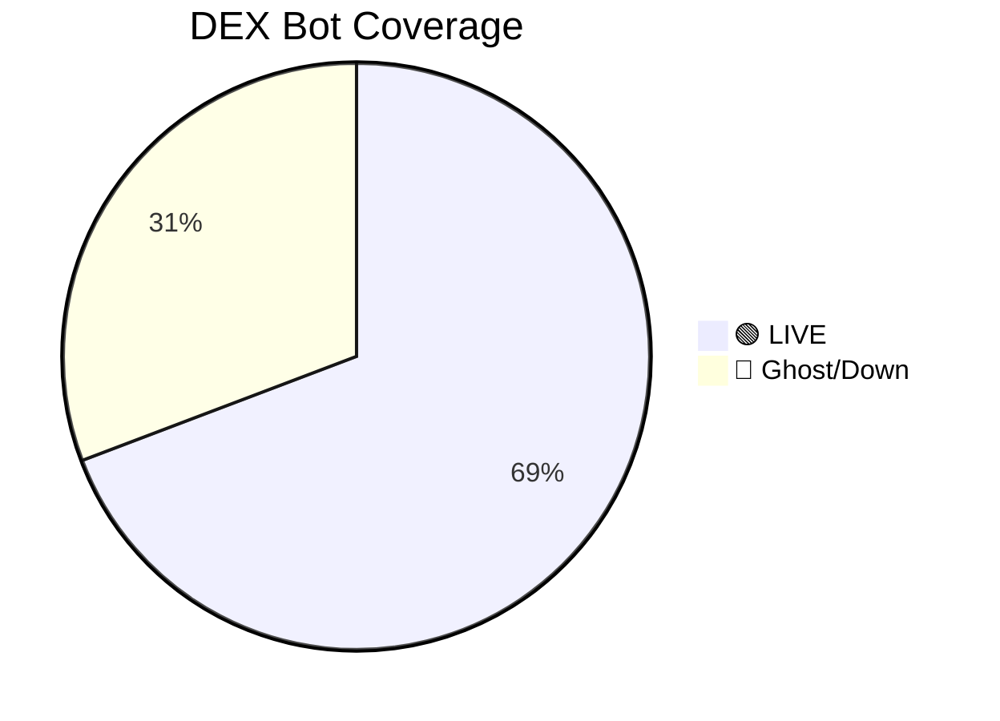

# 🤖 Bot & Scenario Health Audit
> Generated: 2026-02-26 06:04:01 UTC

## FreqTrade Mode

- Mode: **⚠️ PAPER**
- Strategy: `BreakoutMomentumV1`
- Stoploss: `-3.0%`
- Trailing Stop: `True`
- Max Open Trades: `3.0`

## Open Positions (Age Detection)

No open trades

## Hummingbot Instances

- MQTT Discovered: **11** bots
- Docker Active: **11** bots
- Combined live: ['nexora_breakout', 'nexora_cross_arb', 'nexora_flash_recovery', 'nexora_funding_arb', 'nexora_hedged', 'nexora_momentum_lp', 'nexora_range_mm', 'nexora_range_mm-20260224-190302', 'nexora_token_snipe', 'nexora_weekend_mm', 'nexora_weekend_mm-20260224-190321']

## Scenario ↔ Bot Cross-Reference (Designed vs Actual)

| Scenario | CEX Class | DEX (Designed) | Bot Deployed | DEX Status |
|----------|-----------|----------------|--------------|------------|
| momentum_lp | ❌ Missing | 40% | `nexora_momentum_lp` | 🟢 LIVE |
| range_mm | ❌ Missing | 70% | `nexora_range_mm` | 🟢 LIVE |
| cross_arb | ❌ Missing | 50% | `nexora_cross_arb` | 🟢 LIVE |
| hedged | ❌ Missing | 50% | `nexora_hedged` | 🟢 LIVE |
| yield_scalp | ❌ Missing | 60% | `nexora_yield_scalp` | 👻 Ghost/Down |
| emergency | ⚪ N/A | 0% | — | ⚪ N/A |
| funding_arb | ❌ Missing | 50% | `nexora_funding_arb` | 🟢 LIVE |
| token_snipe | ⚪ N/A | 100% | `nexora_token_snipe` | 🟢 LIVE |
| grid_hedge | ❌ Missing | 50% | `nexora_grid_hedge` | 👻 Ghost/Down |
| flash_recovery | ❌ Missing | 40% | `nexora_flash_recovery` | 🟢 LIVE |
| stable_yield | ⚪ N/A | 100% | `nexora_stable_yield` | 👻 Ghost/Down |
| breakout_confirm | ❌ Missing | 30% | `nexora_breakout` | 🟢 LIVE |
| weekend_mm | ❌ Missing | 80% | `nexora_weekend_mm` | 🟢 LIVE |
| multichain_arb | ⚪ N/A | 100% | `nexora_multichain_arb` | 👻 Ghost/Down |

### Classification Summary

- ✅ **9** of 13 DEX scenarios have a live bot
- 🔴 **0** DEX scenarios have no bot assigned yet (future phases)
- 👻 **4** bots assigned but not currently running

## Legend

| Symbol | Meaning |
|--------|---------|
| 🟢 LIVE | Bot is heartbeating via MQTT or confirmed in Docker |
| 👻 Ghost/Down | Bot was assigned but not currently running |
| 🔴 NOT DEPLOYED | Scenario needs a bot but none assigned yet |
| ⚠️ STALE | Open trade > 24h |
| ⚪ N/A | Designed allocation is 0% |
