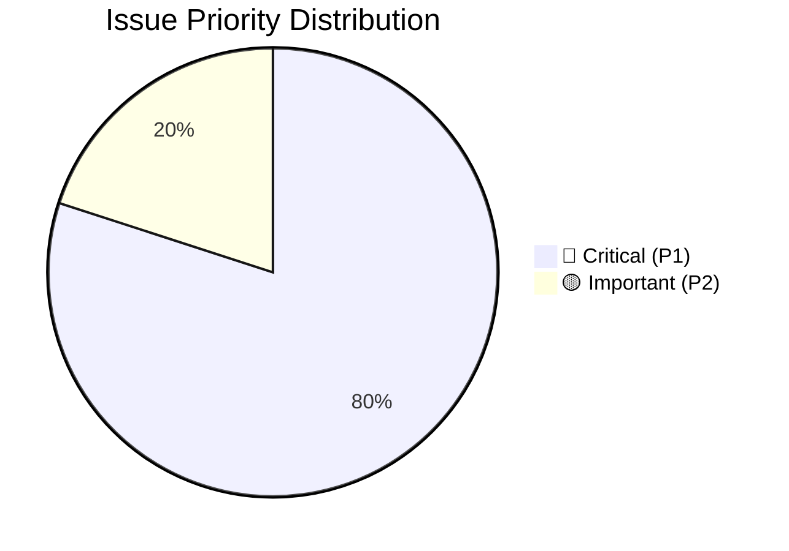
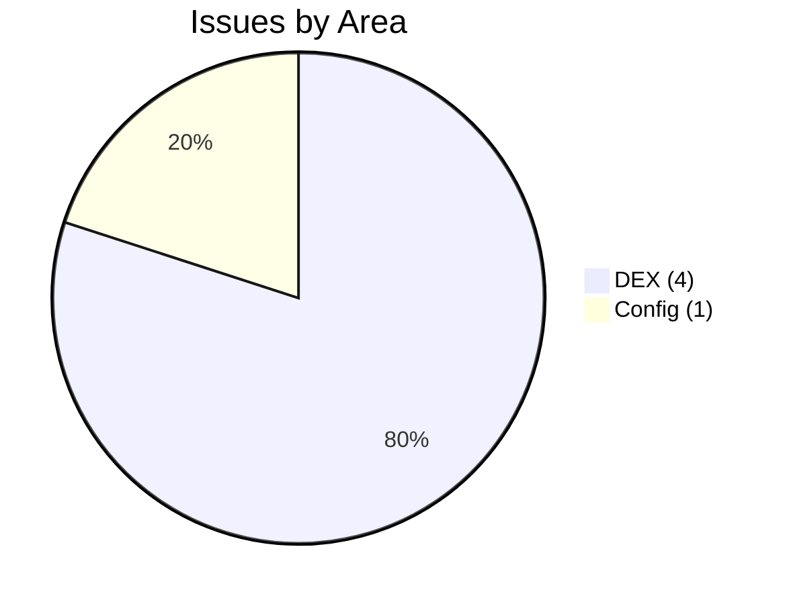
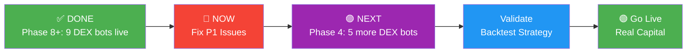

# 🚨 Issue Tracker & Progress Report
> Generated: 2026-02-26 06:04:06 UTC

## Summary

- **🔴 P1 (Critical)**: 4
- **🟡 P2 (Important)**: 1

## All Issues

| # | Priority | Area | Issue | Action Required |
|---|----------|------|-------|-----------------|
| 1 | 🔴 P1 | DEX | yield_scalp: bot 'nexora_yield_scalp' assigned but NOT RUNNING | Redeploy: POST /bot-orchestration/deploy-v2-script with instance_name=nexora_yield_scalp |
| 2 | 🔴 P1 | DEX | grid_hedge: bot 'nexora_grid_hedge' assigned but NOT RUNNING | Redeploy: POST /bot-orchestration/deploy-v2-script with instance_name=nexora_grid_hedge |
| 3 | 🔴 P1 | DEX | stable_yield: bot 'nexora_stable_yield' assigned but NOT RUNNING | Redeploy: POST /bot-orchestration/deploy-v2-script with instance_name=nexora_stable_yield |
| 4 | 🔴 P1 | DEX | multichain_arb: bot 'nexora_multichain_arb' assigned but NOT RUNNING | Redeploy: POST /bot-orchestration/deploy-v2-script with instance_name=nexora_multichain_arb |
| 5 | 🟡 P2 | Config | FreqTrade in PAPER mode — not generating real P&L | Switch to live when strategy is validated |

## 🏗 System Integrity: Designed vs Actual

| Scenario | Designed DEX% | DEX Strategy | Bot | Status |
|----------|--------------|--------------|-----|--------|
| momentum_lp | 40% | liquidity_mining | `nexora_momentum_lp` | 🟢 LIVE |
| range_mm | 70% | market_making | `nexora_range_mm` | 🟢 LIVE |
| cross_arb | 50% | arbitrage_buy | `nexora_cross_arb` | 🟢 LIVE |
| hedged | 50% | perp_hedge | `nexora_hedged` | 🟢 LIVE |
| yield_scalp | 60% | lp_raydium | `nexora_yield_scalp` | 🔴 DOWN |
| emergency | 0% | remove_all_lp | — | ✅ N/A |
| funding_arb | 50% | perp_long_dydx | `nexora_funding_arb` | 🟢 LIVE |
| token_snipe | 100% | market_buy | `nexora_token_snipe` | 🟢 LIVE |
| grid_hedge | 50% | concentrated_lp | `nexora_grid_hedge` | 🔴 DOWN |
| flash_recovery | 40% | dip_buy_jupiter | `nexora_flash_recovery` | 🟢 LIVE |
| stable_yield | 100% | deposit_curve | `nexora_stable_yield` | 🔴 DOWN |
| breakout_confirm | 30% | correlated_buy | `nexora_breakout` | 🟢 LIVE |
| weekend_mm | 80% | tight_spread_mm | `nexora_weekend_mm` | 🟢 LIVE |
| multichain_arb | 100% | cross_chain_arb | `nexora_multichain_arb` | 🔴 DOWN |

> **9 of 13** DEX scenarios LIVE. 0 pending Phase 4 deployment. 4 down/unreachable.

## Progress Roadmap

## ⚡ Immediate Actions Required

1. **[DEX]** Redeploy: POST /bot-orchestration/deploy-v2-script with instance_name=nexora_yield_scalp
   - *Cause*: yield_scalp: bot 'nexora_yield_scalp' assigned but NOT RUNNING
2. **[DEX]** Redeploy: POST /bot-orchestration/deploy-v2-script with instance_name=nexora_grid_hedge
   - *Cause*: grid_hedge: bot 'nexora_grid_hedge' assigned but NOT RUNNING
3. **[DEX]** Redeploy: POST /bot-orchestration/deploy-v2-script with instance_name=nexora_stable_yield
   - *Cause*: stable_yield: bot 'nexora_stable_yield' assigned but NOT RUNNING
4. **[DEX]** Redeploy: POST /bot-orchestration/deploy-v2-script with instance_name=nexora_multichain_arb
   - *Cause*: multichain_arb: bot 'nexora_multichain_arb' assigned but NOT RUNNING

---
> Next review: Run `bash scripts/run_all_reports.sh` to regenerate all reports
