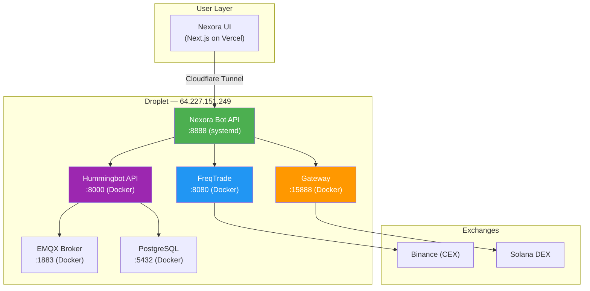
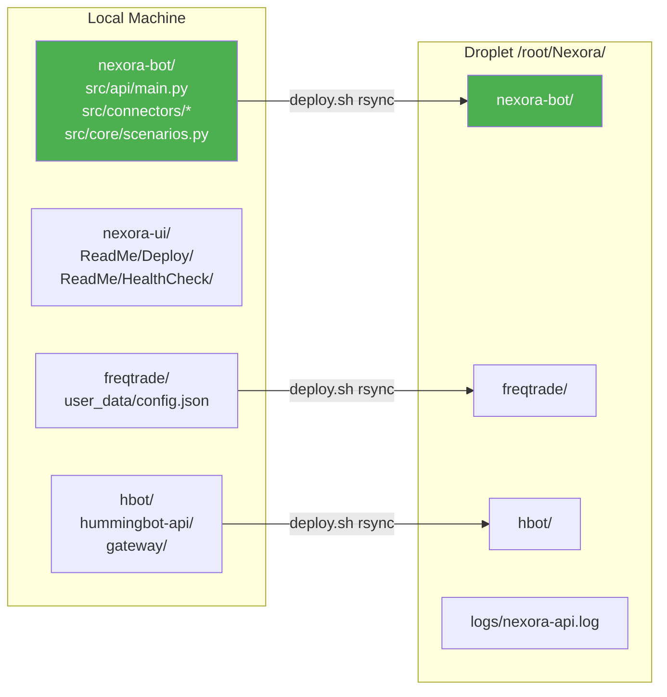
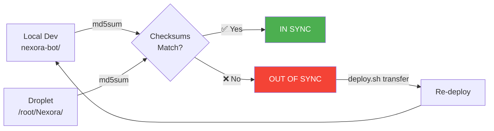
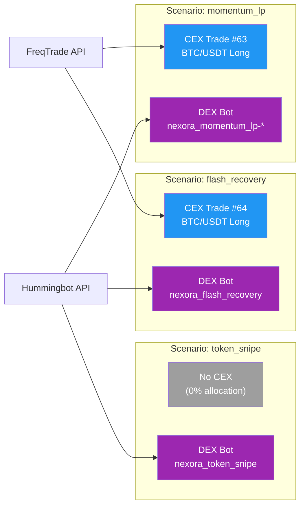
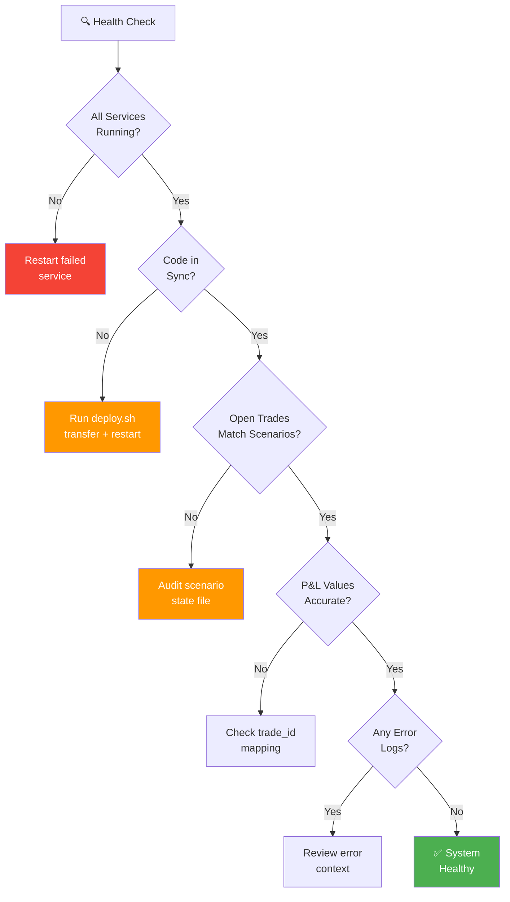
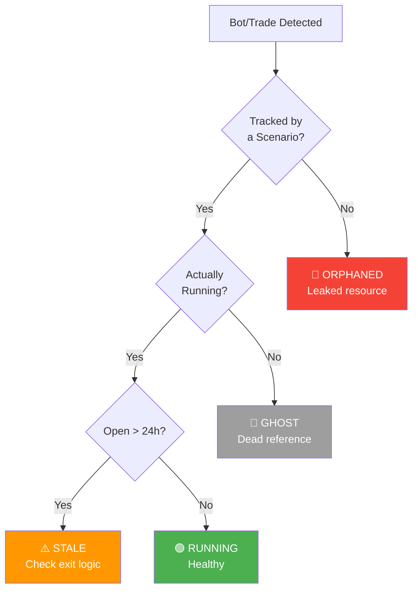
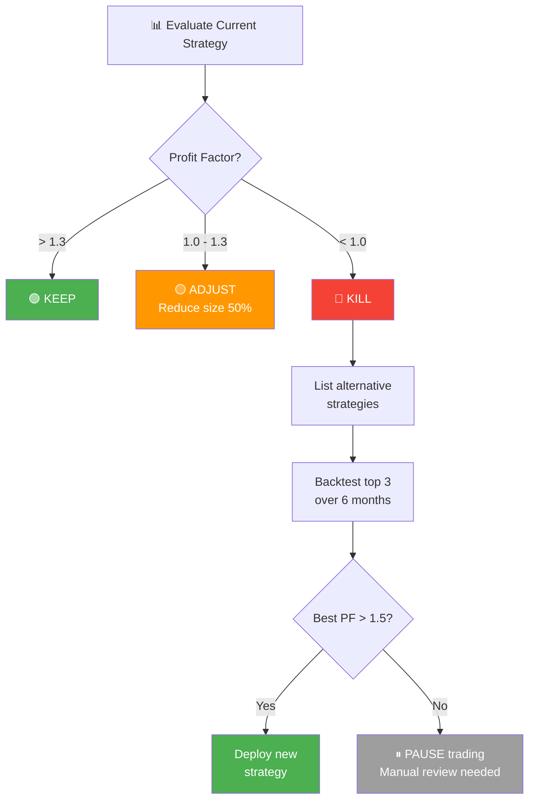
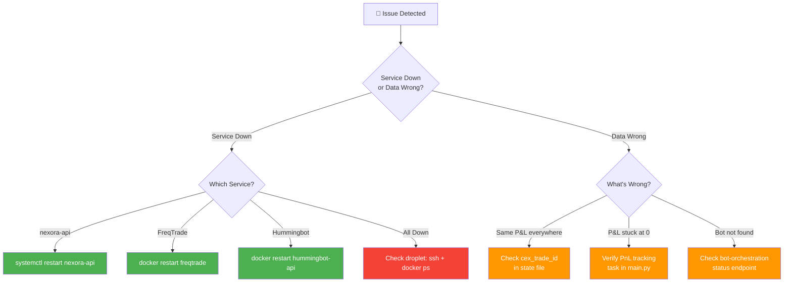
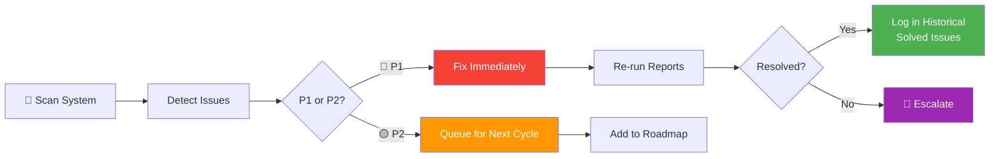

# 🤖 Nexora AI Agent — Complete System Guide & Monitoring Prompt

> **Purpose**: The single source of truth for operating, monitoring, and evaluating the Nexora trading system. This file contains everything a new AI Agent, developer, or operator needs — no additional context required.
>
> **Last Updated**: 2026-03-09 | **Version**: 2.3

---
 
## 🎯 AIM & Target Benchmarks

> **Ultimate Goal**: Nexora must act like a highly successful, profitable, professional trader earning **2% daily profit**.

| Metric | Minimum Target | Ideal Target | Kill Threshold |
|--------|---------------|-------------|----------------|
| **Daily P&L** | +1% ($10/day on $1K) | +2% ($20/day) | < -1% for 3 consecutive days |
| **Profit Factor** | > 1.3 | > 1.8 | < 1.0 = **bleeding money** |
| **Win Rate** | > 60% | > 68% | < 50% = random noise |
| **Sharpe Ratio** | > 1.0 | > 2.0 | < 0 = negative risk-adjusted returns |
| **Sortino Ratio** | > 1.5 | > 2.5 | < 0 = excessive downside risk |
| **Max Drawdown** | < 5% | < 3% | > 10% = **emergency stop** |
| **Expectancy/Trade** | > $0.30 | > $1.00 | < $0 = losing system |
| **Avg Trade Duration** | 15m-4h | 30m-2h | > 24h = stale positions |

### Decision Rules

- **Profit Factor < 1.0 for 3+ days** → Kill the strategy, switch to next best
- **Max Drawdown > 10%** → Emergency stop, manual review
- **DEX bots returning $0.00** → DEX integration is broken, escalate
- **Win Rate < 50%** → Strategy is no better than a coin flip, re-backtest

---

## 📋 Table of Contents

- [AIM & Target Benchmarks](#-aim--target-benchmarks)
- [System Architecture Overview](#system-architecture-overview)
- [System Context & Access](#-system-context--access)
- [Executive Summary View](#-executive-summary-view)
- [Project Manager View](#-project-manager-view)
- [Team Lead View](#-team-lead-view)
- [Developer View](#-developer-view)
- [Trading Performance Monitor](#-trading-performance-monitor)
- [Bot & Scenario Health Audit](#-bot--scenario-health-audit)
- [Strategy Health & Risk Assessment](#-strategy-health--risk-assessment)
- [Issue Tracker & Progress](#-issue-tracker--progress)
- [Report Execution Scripts](#-report-execution-scripts)
- [Scheduled Monitoring Checklist](#-scheduled-monitoring-checklist)
- [Troubleshooting Playbook](#-troubleshooting-playbook)
- [Historical Context & Solved Issues](#-historical-context--solved-issues)
- [Appendix: Command Reference](#-appendix-command-reference)

---

## System Architecture Overview



### Key Design Rules

- **UI is STRICTLY LOCAL / Vercel** — never develop on the droplet
- **Backend runs EXCLUSIVELY on the droplet** — never run the engine locally
- **Communication**: UI → API via HTTP polling (5s interval). No WebSockets for primary state.
- **State file**: Active scenario state persists to `/tmp/nexora_scenarios.json` on the droplet
- **Localhost on droplet**: All inter-service calls use `127.0.0.1` (not `localhost`) to avoid IPv6 issues

---

## 🔐 System Context & Access

> **For any new AI Agent**: This section contains everything you need to connect to and operate the Nexora system. No additional context is required.

### Droplet (Production Server)

| Field | Value |
|-------|-------|
| **Provider** | DigitalOcean |
| **Droplet Name** | `api-digi` |
| **IP Address** | `64.227.151.249` |
| **OS** | Ubuntu 24.04 LTS |
| **RAM** | 8 GB |
| **User** | `root` |

### SSH Connection

```bash
# SSH Key Location (LOCAL machine)
SSH_KEY="/home/drek/AkhaSoft/Nexora/nexora-ui/ReadMe/Deploy/mysshkey"

# Connect interactively
ssh -i $SSH_KEY -o StrictHostKeyChecking=no root@64.227.151.249

# Run a single command remotely
ssh -i $SSH_KEY -o StrictHostKeyChecking=no root@64.227.151.249 "<command>"
```

> **⚠️ Permission**: SSH key must be `chmod 600`. If SSH times out, check the DigitalOcean Cloud Firewall — it may be blocking your current IP on Port 22.

### Service Credentials

| Service | Port | Username | Password | Auth Type |
|---------|------|----------|----------|----------|
| **Nexora Bot API** | 8888 | — | key: `nexora-api-key-12345` | API Key |
| **FreqTrade** | 8080 | `freqtrader` | `SuperSecurePassword` | HTTP Basic |
| **Hummingbot API** | 8000 | `admin` | `admin123` | HTTP Basic |
| **Gateway** | 15888 | — | passphrase: `nexora123` | Passphrase |
| **PostgreSQL** | 5432 | `nexora` | `nexora_password` | DB Auth |

### Cloudflare Tunnel (UI → API)

The UI reaches the droplet API through a Cloudflare Quick Tunnel (ephemeral URL). If the tunnel expires:

```bash
# Restart tunnel on droplet
ssh -i $SSH_KEY root@64.227.151.249 "pkill cloudflared && nohup cloudflared tunnel --url http://localhost:8888 > /tmp/cloudflared.log 2>&1 &"

# Get the new URL
ssh -i $SSH_KEY root@64.227.151.249 "cat /tmp/cloudflared.log | grep 'https://'"

# Then update nexora-ui/.env.local with the new NEXT_PUBLIC_API_URL
```

### Repository Layout



---

## 🏢 Executive Summary View

> **Audience**: C-suite, stakeholders wanting a one-glance health check.

### Agent Prompt — Executive Report

```
You are the Nexora Trading System Monitor. Generate a concise EXECUTIVE SUMMARY
covering:

1. SYSTEM STATUS: Is the system operational? (UP / DEGRADED / DOWN)
2. ACTIVE SCENARIOS: How many scenarios are live? What is aggregate P&L?
3. CAPITAL AT RISK: Total capital deployed across all scenarios.
4. KEY ALERTS: Any critical issues requiring immediate attention?
5. 24h TREND: Is overall P&L improving, flat, or declining?

Format as a dashboard card with traffic-light indicators:
  🟢 = Healthy    🟡 = Warning    🔴 = Critical

Commands to execute:
  - SSH to droplet: systemctl is-active nexora-api
  - Docker health: docker ps --format 'table {{.Names}}\t{{.Status}}'
  - Active scenarios: curl -s http://localhost:8888/api/scenarios/active
  - FreqTrade status: curl -s -u freqtrader:SuperSecurePassword http://localhost:8080/api/v1/status
```

### Expected Output Format

```
┌─────────────────────────────────────────────────┐
│           NEXORA EXECUTIVE DASHBOARD            │
├────────────────────┬────────────────────────────┤
│ System Health      │ 🟢 ALL SERVICES RUNNING    │
│ Active Scenarios   │ 3 of 14 deployed           │
│ Total Capital      │ $3,000.00                  │
│ Aggregate P&L      │ -$27.48 (-0.92%)           │
│ CEX Positions      │ 2 open trades              │
│ DEX Bots           │ 1 deployed instance        │
│ 24h Trend          │ 🟡 Slight drawdown         │
│ Critical Alerts    │ 🟢 None                    │
└────────────────────┴────────────────────────────┘
```

---

## 📊 Project Manager View

> **Audience**: PMs tracking deployment sync, sprint health, and release readiness.

### Agent Prompt — Deployment & Sync Report

```
You are the Nexora Deployment Monitor. Check and report:

1. CODE SYNC STATUS
   - Compare local nexora-bot files against the droplet using md5sum checksums.
   - Files to check:
     • src/api/main.py
     • src/connectors/freqtrade_client.py
     • src/connectors/hummingbot_client.py
     • src/core/scenarios.py
   - Are there any UNSTAGED or UNCOMMITTED local changes?
     Run: cd /home/drek/AkhaSoft/Nexora/nexora-bot && git status --short
   - Are staged changes deployed to the droplet?
     Compare: md5sum <local files> vs ssh root@droplet md5sum <remote files>

2. SERVICE VERSIONS
   - FreqTrade version: curl -s -u freqtrader:SuperSecurePassword http://localhost:8080/api/v1/version
   - Hummingbot API version: Check docker image tag
   - Nexora Bot API: Check git log -1 on droplet

3. DEPLOYMENT PIPELINE STATUS
   - Last transfer timestamp (from deploy.sh logs)
   - Any file mismatches between local and remote

Format as a table with ✅ In Sync / ⚠️ Out of Sync / ❌ Missing indicators.
```

### Sync Verification Flow



### Expected Output Format

```
┌──────────────────────────────────┬──────────┬──────────────────────────┐
│ File                             │ Status   │ Notes                    │
├──────────────────────────────────┼──────────┼──────────────────────────┤
│ src/api/main.py                  │ ⚠️ Local  │ User removed PnL tracker │
│ src/connectors/freqtrade_client  │ ✅ Sync   │ Identical checksums      │
│ src/connectors/hummingbot_client │ ✅ Sync   │ Identical checksums      │
│ src/core/scenarios.py            │ ✅ Sync   │ Identical checksums      │
└──────────────────────────────────┴──────────┴──────────────────────────┘
```

---

## 🛠 Team Lead View

> **Audience**: Tech leads overseeing scenario execution quality, P&L isolation, and bot orchestration.

### Agent Prompt — Scenario Execution Quality

```
You are the Nexora Scenario Quality Monitor. Perform the following checks:

1. SCENARIO ISOLATION VERIFICATION
   - For each active scenario, verify that:
     a. cex_trade_id is set and unique (no two scenarios share a trade)
     b. dex_bot_name is set and corresponds to a real Hummingbot instance
     c. P&L values are independently calculated (not duplicated across cards)
   - Read state: cat /tmp/nexora_scenarios.json
   - Cross-check against FreqTrade open trades:
     curl -s -u freqtrader:SuperSecurePassword http://localhost:8080/api/v1/status

2. P&L ACCURACY AUDIT
   - For each scenario with a cex_trade_id:
     • Fetch that trade's profit_abs from FreqTrade
     • Compare against the scenario's stored cex_pnl
     • Flag any mismatch > $0.10
   - For DEX: Check if dex_bot_name exists in Hummingbot orchestrator:
     curl -s -u admin:admin123 http://localhost:8000/bot-orchestration/status

3. EXECUTION LOG HEALTH
   - Check each scenario's execution_log length
   - Flag if logs are growing excessively (>100 entries = trim needed)
   - Verify logs contain unique, scenario-specific entries

Report format: Per-scenario breakdown with PASS/FAIL indicators.
```

### Scenario Isolation Model



---

## 💻 Developer View

> **Audience**: Engineers debugging, deploying, and extending the system.

### Agent Prompt — Full Technical Health Check

```
You are the Nexora System Engineer Agent. Run a comprehensive technical
health check covering all layers:

═══════════════════════════════════════════════════
PHASE 1: INFRASTRUCTURE
═══════════════════════════════════════════════════

1. SERVICE HEALTH (run on droplet via SSH)
   systemctl is-active nexora-api
   docker ps -a --format 'table {{.Names}}\t{{.Status}}\t{{.Ports}}'
   
2. RESOURCE UTILIZATION
   free -h                     # Memory
   df -h /                     # Disk
   top -bn1 | head -5          # CPU load

3. NETWORK CONNECTIVITY
   curl -s http://localhost:8888/api/health     # Nexora API
   curl -s http://localhost:8080/api/v1/ping    # FreqTrade (with auth)
   curl -s http://localhost:8000/               # Hummingbot API
   curl -s http://localhost:15888/              # Gateway

═══════════════════════════════════════════════════
PHASE 2: CODE SYNC VERIFICATION
═══════════════════════════════════════════════════

4. LOCAL GIT STATUS
   cd /home/drek/AkhaSoft/Nexora/nexora-bot
   git status --short
   git diff --stat                    # Unstaged changes
   git diff --cached --stat           # Staged changes
   git log -1 --oneline               # Last commit

5. LOCAL ↔ DROPLET FILE COMPARISON
   For each critical file, compare md5sum:
     src/api/main.py
     src/connectors/freqtrade_client.py
     src/connectors/hummingbot_client.py
     src/core/scenarios.py
     .env

═══════════════════════════════════════════════════
PHASE 3: TRADING STATE
═══════════════════════════════════════════════════

6. FREQTRADE POSITIONS
   curl -s -u freqtrader:SuperSecurePassword \
     http://localhost:8080/api/v1/status | jq '.[].trade_id, .[].pair, .[].profit_abs'

7. HUMMINGBOT BOTS
   curl -s -u admin:admin123 \
     http://localhost:8000/bot-orchestration/status | jq .

8. ACTIVE SCENARIOS
   curl -s http://localhost:8888/api/scenarios/active | jq \
     '.scenarios[] | {id, pnl, cex_pnl, dex_pnl, started_at}'

9. SCENARIO STATE FILE
   cat /tmp/nexora_scenarios.json | jq 'to_entries[] |
     {scenario: .key, trade_id: .value.cex_trade_id,
      dex_bot: .value.dex_bot_name, pnl: .value.pnl}'

═══════════════════════════════════════════════════
PHASE 4: LOG ANALYSIS
═══════════════════════════════════════════════════

10. RECENT API ERRORS
    grep -i 'error\|exception\|traceback' /root/Nexora/logs/nexora-api.log \
      | tail -20

11. FREQTRADE LOGS
    docker logs freqtrade --tail 20 2>&1 | grep -i 'error\|warn'

12. HUMMINGBOT API LOGS
    docker logs hummingbot-api --tail 20 2>&1 | grep -i 'error\|404\|500'

═══════════════════════════════════════════════════
OUTPUT FORMAT
═══════════════════════════════════════════════════

Present findings as:
  ✅ PASS — Component healthy, no action needed
  ⚠️ WARN — Non-critical issue, monitor closely
  ❌ FAIL — Requires immediate attention

Group by phase. Include raw values for any WARN or FAIL items.
End with a RECOMMENDED ACTIONS section if any issues found.
```

### Diagnostic Decision Tree



---

## 📅 Scheduled Monitoring Checklist

> Use this as a recurring schedule for the AI Agent or operator.

### Frequency Matrix

| Check | Every 5m | Every 30m | Every 4h | Daily | Weekly |
|-------|:--------:|:---------:|:--------:|:-----:|:------:|
| Service heartbeat (ping) | ✅ | | | | |
| P&L sync accuracy | | ✅ | | | |
| **Trading performance check** | | ✅ | | | |
| Code sync verification | | | ✅ | | |
| Error log review | | | ✅ | | |
| **Strategy health assessment** | | | ✅ | | |
| Scenario isolation audit | | | | ✅ | |
| Resource utilization | | | | ✅ | |
| **Full trading metrics audit** | | | | ✅ | |
| Full technical health check | | | | | ✅ |
| FreqTrade config audit | | | | | ✅ |
| Hummingbot credentials check | | | | | ✅ |
| **Strategy backtest validation** | | | | | ✅ |
| Deployment state backup | | | | | ✅ |

### Monitoring Timeline

```mermaid
gantt
    title Daily Monitoring Schedule (UTC)
    dateFormat HH:mm
    axisFormat %H:%M

    section Heartbeat (5m)
    Service pings           :active, 00:00, 23:59

    section P&L Sync (30m)
    P&L accuracy check      :crit, 00:00, 23:59

    section Deep Check (4h)
    Code sync + log review  :06:00, 30m
    Code sync + log review  :10:00, 30m
    Code sync + log review  :14:00, 30m
    Code sync + log review  :18:00, 30m
    Code sync + log review  :22:00, 30m

    section Daily
    Full isolation audit    :09:00, 1h
    Resource check          :09:00, 30m
```



---

## 📈 Trading Performance Monitor

> **Audience**: Any user or AI agent checking if the system is **actually making money**. This is the most critical section.

### Quick Pulse Check — "Am I making money?"

```
You are the Nexora Trading Performance Monitor. Run this quick check
ON THE DROPLET via SSH:

ssh -i /home/drek/AkhaSoft/Nexora/nexora-ui/ReadMe/Deploy/mysshkey \
  -o StrictHostKeyChecking=no root@64.227.151.249 "<commands below>"

1. OVERALL P&L SNAPSHOT
   curl -s -u freqtrader:SuperSecurePassword \
     http://localhost:8080/api/v1/profit | python3 -c '
import json,sys; d=json.load(sys.stdin)
print(f"""━━━ TRADING PULSE CHECK ━━━
  Total P&L:        ${d.get("profit_all_coin",0):.2f}
  Closed P&L:       ${d.get("profit_closed_coin",0):.2f}
  Win Rate:         {d.get("winrate",0)*100:.1f}%
  Profit Factor:    {d.get("profit_factor",0):.2f}
  Sharpe Ratio:     {d.get("sharpe",0):.2f}
  Sortino Ratio:    {d.get("sortino",0):.2f}
  Max Drawdown:     ${d.get("max_drawdown_abs",0):.2f} ({d.get("max_drawdown",0)*100:.2f}%)
  Expectancy:       ${d.get("expectancy",0):.4f}/trade
  Total Trades:     {d.get("trade_count",0)} ({d.get("winning_trades",0)}W / {d.get("losing_trades",0)}L)
  Closed Trades:    {d.get("closed_trade_count",0)}
  Avg Duration:     {d.get("avg_duration","N/A")}
  Best Pair:        {d.get("best_pair","N/A")} (${d.get("best_pair_profit_abs",0):.2f})
  Trading Volume:   ${d.get("trading_volume",0):,.2f}
  CAGR:             {d.get("cagr",0)*100:.2f}%
  Calmar Ratio:     {d.get("calmar",0):.2f}
  SQN:              {d.get("sqn",0):.4f}
  Bot Running Since:{d.get("first_trade_date","N/A")}
  Latest Trade:     {d.get("latest_trade_date","N/A")}
""")
# VERDICT
pf = d.get("profit_factor",0)
wr = d.get("winrate",0)
sh = d.get("sharpe",0)
if pf > 1.3 and wr > 0.6 and sh > 1.0:
    print("  VERDICT: 🟢 ON TRACK — System is profitable")
elif pf > 1.0 and wr > 0.55:
    print("  VERDICT: 🟡 MARGINAL — Profitable but below targets")
else:
    print("  VERDICT: 🔴 OFF TRACK — System is LOSING money. Action required.")
print("━━━━━━━━━━━━━━━━━━━━━━━━━━")
'

2. OPEN POSITIONS
   curl -s -u freqtrader:SuperSecurePassword \
     http://localhost:8080/api/v1/status | python3 -c '
import json,sys; trades=json.load(sys.stdin)
if not trades: print("  No open trades")
for t in trades:
    emoji = "🟢" if t.get("profit_pct",0) > 0 else "🔴"
    print(f"  {emoji} #{t["trade_id"]} {t["pair"]} | P&L: ${t.get("profit_abs",0):.2f} ({t.get("profit_pct",0):.1f}%) | Stake: ${t["stake_amount"]:.0f} | Open: {t["open_date"][:16]}")
'

3. SCENARIO STATUS + CAPITAL
   curl -s http://localhost:8888/api/scenarios/active | python3 -c '
import json,sys; d=json.load(sys.stdin)
print("━━━ SCENARIO TRACKING ━━━")
total_capital = 0
for s in d["scenarios"]:
    total = s.get("pnl",0)
    cap = s.get("capital",0)
    total_capital += cap
    emoji = "🟢" if total > 0 else "🔴" if total < 0 else "⚪"
    dex = s.get("dex_pnl",0)
    dex_status = "✅" if dex != 0 else "❌ DEAD"
    print(f"  {emoji} {s["id"]}: ${total:.2f} (CEX=${s.get("cex_pnl",0):.2f}, DEX={dex_status} ${dex:.2f}) | Capital: ${cap:,.0f} | Since: {s.get("started_at","N/A")[:16]}")
print(f"  Total Capital Deployed: ${total_capital:,.0f}")
print(f"  Scenarios: {d.get("count",0)} active")
'

4. TRADING MODE CHECK
   curl -s -u freqtrader:SuperSecurePassword http://localhost:8080/api/v1/show_config | python3 -c '
import json,sys; d=json.load(sys.stdin)
print("━━━ TRADING MODE ━━━")
if d.get("dry_run"):
    print("  ⚠️  FreqTrade: PAPER TRADING (dry_run=True) — NOT real money")
else:
    print("  🟢 FreqTrade: LIVE TRADING — Real capital at risk")
print(f"  Strategy: {d.get("strategy","unknown")}")
print(f"  Timeframe: {d.get("timeframe","unknown")}")
print(f"  Stoploss: {d.get("stoploss","NOT SET")}")
'

Compare ALL metrics against the AIM targets at the top of this document.
Flag any metric below the Kill Threshold.
```

### Daily Trading Report — Detailed Analysis

```
You are the Nexora Daily Trading Analyst. Run ON THE DROPLET:

1. FULL PROFIT BREAKDOWN
   curl -s -u freqtrader:SuperSecurePassword http://localhost:8080/api/v1/profit

2. RECENT TRADE HISTORY (last 50)
   curl -s -u freqtrader:SuperSecurePassword \
     'http://localhost:8080/api/v1/trades?limit=50' | python3 -c '
import json,sys; d=json.load(sys.stdin)
trades = d.get("trades",[])
closed = [t for t in trades if not t["is_open"]]
print(f"Total: {len(trades)}, Closed: {len(closed)}")
total = sum(t.get("profit_abs",0) for t in closed)
print(f"Closed P&L sum: ${total:.2f}")
for t in sorted(closed, key=lambda x: x.get("close_date",""), reverse=True)[:10]:
    emoji = "🟢" if t.get("profit_abs",0) > 0 else "🔴"
    print(f"  {emoji} #{t["trade_id"]} {t["pair"]} | ${t.get("profit_abs",0):.2f} ({t.get("profit_pct",0):.1f}%) | {t.get("open_date","")[:16]} → {t.get("close_date","")[:16]}")
'

3. STRATEGY CONFIGURATION CHECK
   curl -s -u freqtrader:SuperSecurePassword http://localhost:8080/api/v1/show_config | python3 -c '
import json,sys; d=json.load(sys.stdin)
print(f"Strategy: {d.get("strategy")}")
print(f"Mode: {"🔴 DRY RUN" if d.get("dry_run") else "🟢 LIVE"}")
print(f"Timeframe: {d.get("timeframe")}")
print(f"Trading mode: {d.get("trading_mode")}")
print(f"Stake currency: {d.get("stake_currency")}")
print(f"Stoploss: {d.get("stoploss","NOT SET")}")
print(f"Trailing stop: {d.get("trailing_stop",False)}")
print(f"Max open trades: {d.get("max_open_trades","Unlimited")}")
'

4. BALANCE CHECK
   curl -s -u freqtrader:SuperSecurePassword http://localhost:8080/api/v1/balance | python3 -c '
import json,sys; d=json.load(sys.stdin)
print(f"Total: {d.get("total",0):.2f} {d.get("stake","USDT")}")
for c in d.get("currencies",[]):
    if c["balance"] > 0:
        print(f"  {c["currency"]}: {c["balance"]:.4f} (free: {c["free"]:.4f})")
'

5. HUMMINGBOT DEX STATUS
   curl -s -u admin:admin123 http://localhost:8000/bot-orchestration/status | python3 -c '
import json,sys; d=json.load(sys.stdin)
bots = d.get("data",{})
if not bots: print("  ❌ ZERO active Hummingbot bots — DEX is non-functional")
else:
    for name, info in bots.items():
        print(f"  ✅ {name}: {info}")
'

Present as a daily report with:
  🟢 ON TRACK metrics
  🟡 MARGINAL metrics (between target and kill threshold)
  🔴 OFF TRACK metrics (below kill threshold)
  📋 RECOMMENDED ACTIONS for any 🔴 items
```

---

## 🤖 Bot & Scenario Health Audit

> **Audience**: Team leads and developers diagnosing ghost bots, orphaned instances, and scenario tracking integrity.

### Agent Prompt — Bot Lifecycle Audit

```
You are the Nexora Bot Health Inspector. Identify ghost, orphaned, and
running bots across both FreqTrade and Hummingbot.

Run ALL commands ON THE DROPLET via SSH.

═══════════════════════════════════════════════════
PART 1: FREQTRADE BOT STATUS
═══════════════════════════════════════════════════

1. TRADING MODE
   curl -s -u freqtrader:SuperSecurePassword \
     http://localhost:8080/api/v1/show_config | python3 -c '
import json,sys; d=json.load(sys.stdin)
print("━━━ FREQTRADE MODE ━━━")
mode = "⚠️ PAPER" if d.get("dry_run") else "🟢 LIVE"
print(f"  Mode: {mode}")
print(f"  Strategy: {d.get("strategy")}")
print(f"  Timeframe: {d.get("timeframe")}")
print(f"  Max Open Trades: {d.get("max_open_trades","Unlimited")}")
sl = d.get("stoploss")
if sl: print(f"  Stoploss: {sl*100:.1f}%")
else: print("  ⚠️ Stoploss: NOT SET — DANGEROUS")
print(f"  Trailing Stop: {d.get("trailing_stop",False)}")
'

2. OPEN TRADES (active positions)
   curl -s -u freqtrader:SuperSecurePassword \
     http://localhost:8080/api/v1/status | python3 -c '
import json,sys; trades=json.load(sys.stdin)
print(f"━━━ OPEN POSITIONS: {len(trades)} ━━━")
total_stake = 0; total_pnl = 0
for t in trades:
    total_stake += t.get("stake_amount",0)
    total_pnl += t.get("profit_abs",0)
    hours = "unknown"
    if t.get("open_date"):
        from datetime import datetime
        try:
            opened = datetime.strptime(t["open_date"][:19], "%Y-%m-%d %H:%M:%S")
            hours = f"{(datetime.utcnow() - opened).total_seconds()/3600:.1f}h"
        except: pass
    stale = "⚠️ STALE" if hours != "unknown" and float(hours[:-1]) > 24 else ""
    emoji = "🟢" if t.get("profit_pct",0) > 0 else "🔴"
    print(f"  {emoji} #{t["trade_id"]} {t["pair"]} | ${t.get("profit_abs",0):.2f} ({t.get("profit_pct",0):.1f}%) | Stake: ${t["stake_amount"]:.0f} | Age: {hours} {stale}")
print(f"  Total Stake Deployed: ${total_stake:,.0f}")
print(f"  Total Open P&L: ${total_pnl:,.2f}")
'

═══════════════════════════════════════════════════
PART 2: HUMMINGBOT BOT STATUS
═══════════════════════════════════════════════════

3. HUMMINGBOT MODE + ACTIVE BOTS
   curl -s -u admin:admin123 http://localhost:8000/bot-orchestration/status | python3 -c '
import json,sys; d=json.load(sys.stdin)
bots = d.get("data",{})
print("━━━ HUMMINGBOT BOTS ━━━")
if not bots:
    print("  ⚠️ ZERO active instances — DEX is NON-FUNCTIONAL")
else:
    for name, info in bots.items():
        print(f"  🟢 RUNNING: {name} — {info}")
print(f"  Total Active: {len(bots)}")
'

4. DOCKER CONTAINER CHECK (detect orphaned processes)
   docker ps -a --filter "label=hummingbot" --format "{{.Names}}\t{{.Status}}" 2>/dev/null
   docker ps -a --filter "name=hummingbot" --format "table {{.Names}}\t{{.Status}}\t{{.CreatedAt}}" 2>/dev/null

═══════════════════════════════════════════════════
PART 3: SCENARIO ↔ BOT CROSS-REFERENCE
═══════════════════════════════════════════════════

5. FIND GHOST & ORPHAN BOTS
   cat /tmp/nexora_scenarios.json | python3 -c '
import json,sys,subprocess
scenarios = json.load(sys.stdin)

print("━━━ BOT HEALTH CLASSIFICATION ━━━")
print("")

# Get FT open trades
try:
    import urllib.request
    req = urllib.request.Request("http://localhost:8080/api/v1/status")
    import base64
    creds = base64.b64encode(b"freqtrader:SuperSecurePassword").decode()
    req.add_header("Authorization", f"Basic {creds}")
    ft_trades = json.loads(urllib.request.urlopen(req, timeout=5).read())
    ft_trade_ids = {t["trade_id"] for t in ft_trades}
except: ft_trade_ids = set();

# Get HB bots
try:
    req2 = urllib.request.Request("http://localhost:8000/bot-orchestration/status")
    creds2 = base64.b64encode(b"admin:admin123").decode()
    req2.add_header("Authorization", f"Basic {creds2}")
    hb_data = json.loads(urllib.request.urlopen(req2, timeout=5).read())
    hb_bots = set(hb_data.get("data",{}).keys())
except: hb_bots = set()

scenario_trade_ids = set()
scenario_dex_bots = set()

for sid, info in scenarios.items():
    tid = info.get("cex_trade_id")
    dex = info.get("dex_bot_name","")
    cex_alloc = info.get("cex_allocation",0)
    dex_alloc = info.get("dex_allocation",0)
    capital = info.get("capital",0)
    
    print(f"📋 Scenario: {sid}")
    print(f"   Capital: ${capital:,.0f} (CEX: ${cex_alloc:,.0f} / DEX: ${dex_alloc:,.0f})")
    
    # CEX check
    if cex_alloc > 0:
        if tid and tid in ft_trade_ids:
            print(f"   CEX: 🟢 RUNNING — Trade #{tid} found in FreqTrade")
            scenario_trade_ids.add(tid)
        elif tid:
            print(f"   CEX: 👻 GHOST — Trade #{tid} referenced but NOT in FreqTrade open trades")
        else:
            print(f"   CEX: ❌ MISSING — No trade_id assigned")
    else:
        print(f"   CEX: ⚪ N/A (0% allocation)")
    
    # DEX check
    if dex_alloc > 0:
        if dex in hb_bots:
            print(f"   DEX: 🟢 RUNNING — Bot \"{dex}\" active in Hummingbot")
            scenario_dex_bots.add(dex)
        else:
            print(f"   DEX: 👻 GHOST — Bot \"{dex}\" referenced but NOT running")
    else:
        print(f"   DEX: ⚪ N/A (0% allocation)")
    print()

# Check for orphaned FT trades (open but not tracked by any scenario)
orphan_trades = ft_trade_ids - scenario_trade_ids
if orphan_trades:
    print(f"🔴 ORPHANED FT TRADES (not tracked by any scenario): {orphan_trades}")
else:
    print("✅ No orphaned FreqTrade trades")

# Check for orphaned HB bots
orphan_bots = hb_bots - scenario_dex_bots
if orphan_bots:
    print(f"🔴 ORPHANED HB BOTS (not tracked by any scenario): {orphan_bots}")
else:
    print("✅ No orphaned Hummingbot bots")
'

═══════════════════════════════════════════════════
PART 4: SCENARIO AUTO-TRIGGER STATUS
═══════════════════════════════════════════════════

6. CHECK AUTO-TRIGGER SCENARIOS
   curl -s http://localhost:8888/api/scenarios/available | python3 -c '
import json,sys; d=json.load(sys.stdin)
print("━━━ AUTO-TRIGGER SCENARIOS ━━━")
for s in d.get("scenarios",[]):
    if s.get("is_auto"):
        print(f"  ⚡ {s["id"]}: {s["name"]} — Trigger: {s.get("trigger",{})}")
'

   curl -s http://localhost:8888/api/scenarios/active | python3 -c '
import json,sys; d=json.load(sys.stdin)
auto_active = [s for s in d["scenarios"] if s.get("is_auto")]
if auto_active:
    print(f"  Active auto-scenarios: {len(auto_active)}")
    for s in auto_active:
        print(f"    🟢 {s["id"]} running since {s.get("started_at","N/A")[:16]}")
else:
    print("  ⚠️ No auto-trigger scenarios are active")
'

═══════════════════════════════════════════════════
OUTPUT CLASSIFICATION
═══════════════════════════════════════════════════

Classify every bot/trade into one of:
  🟢 RUNNING  — Active, tracked by a scenario, P&L updating
  👻 GHOST    — Referenced in scenario state but not actually running
  🔴 ORPHANED — Running but NOT tracked by any scenario (leaked resource)
  ⚪ N/A      — Zero allocation, correctly unused
  ⚠️ STALE    — Open trade older than 24h with no exit signal
```

### Bot Classification Diagram



---

## 🛡 Strategy Health & Risk Assessment

> **Audience**: Team leads and AI agents evaluating whether to keep, kill, or switch the active trading strategy.

### Agent Prompt — Strategy Kill/Keep Decision

```
You are the Nexora Strategy Evaluator. Determine if the current strategy
should be KEPT, ADJUSTED, or KILLED.

Run ON THE DROPLET:

1. GET PERFORMANCE METRICS
   curl -s -u freqtrader:SuperSecurePassword http://localhost:8080/api/v1/profit

2. APPLY KILL CRITERIA
   Evaluate against these thresholds:

   | Metric          | Keep (🟢)  | Adjust (🟡) | Kill (🔴)      |
   |-----------------|-----------|------------|----------------|
   | Profit Factor   | > 1.3     | 1.0 - 1.3  | < 1.0          |
   | Win Rate        | > 60%     | 50% - 60%  | < 50%          |
   | Sharpe Ratio    | > 1.0     | 0 - 1.0    | < 0            |
   | Max Drawdown    | < 5%      | 5% - 10%   | > 10%          |
   | Expectancy      | > $0.30   | $0 - $0.30 | < $0           |
   | Avg Duration    | < 4h      | 4h - 12h   | > 24h          |

3. CHECK AVAILABLE STRATEGIES
   ls /root/Nexora/freqtrade/user_data/strategies/ | grep -v __pycache__ | grep -v archive

4. DECISION OUTPUT:
   🟢 KEEP  — Strategy is profitable, continue running
   🟡 ADJUST — Strategy is marginal, consider parameter tuning or
              reducing position size by 50%
   🔴 KILL  — Strategy is losing money. Recommend:
              a. Stop the current strategy
              b. List top 3 alternative strategies from the directory
              c. Suggest running backtests before switching

5. RISK CHECK
   - Is stoploss configured? (must be set, e.g., -0.02 for 2%)
   - Is trailing_stop enabled?
   - Is max_open_trades limited? (not unlimited)
   - Is the system in DRY RUN or LIVE mode?
   - What is the current open position heat
     (sum of all open stakes / total balance)?
```

### Strategy Performance Comparison



---

## 🔧 Troubleshooting Playbook

### Common Issues & Fixes

| Problem | Cause | Fix |
|---------|-------|-----|
| `Connection refused :8888` | nexora-api crashed | `systemctl restart nexora-api` |
| `Connection refused :8080` | FreqTrade container down | `docker restart freqtrade` |
| `force_entry not enabled` | FreqTrade config reset | Set `force_entry_enable: true` in config.json, restart |
| `Bot X not found` (Hummingbot) | Bot name mismatch or not deployed | Check `/bot-orchestration/status`, redeploy |
| All scenarios show same P&L | Missing `cex_trade_id` isolation | Verify unique trade_ids in state file |
| Scenario P&L stuck at $0 | P&L tracking task not running | Check `scenario_pnl_tracking_task` in main.py startup |
| P&L resets to $0 after trade closes | `update_pnl_from_bots()` didn't preserve closed-trade PnL | Fixed: preserves last known PnL when trade disappears from open trades |
| Duplicate log entries per scenario | `sync_execution_logs()` logged same trade from both history and active-orders paths | Fixed: cross-checks `known_trade_ids` before logging from active-orders |
| SSH timeout | DO firewall blocking IP | Update DigitalOcean Cloud Firewall rules |
| Cloudflare tunnel down | Process expired | Restart `cloudflared` on droplet (see System Context) |
| `502 Bad Gateway` from FreqTrade | FreqTrade restarting | Wait 30s and retry, or check `docker logs freqtrade` |
| IPv6 connection issues | `localhost` resolving to `::1` | Use `127.0.0.1` instead of `localhost` in configs |

### Emergency Procedures

```bash
# Stop ALL scenarios immediately
curl -X POST http://localhost:8888/api/scenarios/emergency

# Force close all FreqTrade positions
curl -s -u freqtrader:SuperSecurePassword -X POST http://localhost:8080/api/v1/forceexitall

# Stop all Hummingbot bots
curl -s -u admin:admin123 -X POST http://localhost:8000/bot-orchestration/stop-all-bots

# Nuclear option: kill everything
systemctl stop nexora-api && docker stop freqtrade hummingbot-api
```

### Troubleshooting Decision Flow



---

## 📜 Historical Context & Solved Issues

> Reference for recurring problems. If you see a familiar error, check here first.

| Issue | Root Cause | Fix Applied |
|-------|-----------|-------------|
| DCA strategy startup failures | Wrong script name in deploy endpoint | Switched to `v2_with_controllers.py` with controller configs |
| API credentials 404 | `master_account` dir missing | Made `list_credentials` resilient to missing dirs |
| Next.js 15 build failure | `params` must be awaited | Added `await` to all dynamic route params |
| Hummingbot bots "not found" | Using old `/bots/` API | Migrated to `/bot-orchestration/` V2 endpoints |
| Duplicate P&L across scenarios | Aggregate pair-level P&L lookup | Isolated by `cex_trade_id` per scenario |
| `localhost` IPv6 resolution | OS resolving to `::1` | Hardcoded `127.0.0.1` in all configs |
| FreqTrade `force_entry` disabled | Config reset on container restart | Persistent config mount + `force_entry_enable: true` |
| Token key naming inconsistency | `access_token` vs `accessToken` | Standardized `Authorization` headers across frontend |
| Scenario log duplication | `sync_execution_logs()` two code paths used different dedup keys | Cross-check `known_trade_ids` in active-orders path (2026-03-09) |
| Trade ID theft between scenarios | `start_scenario()` fallback poll grabbed claimed trades | Exclude `already_claimed` trade IDs during poll (2026-03-09) |
| PnL reset to $0 on trade close | `update_pnl_from_bots()` returned 0 when trade left open-trades | Preserve last known `cex_pnl` when trade_id disappears (2026-03-09) |

---

## 📎 Appendix: Command Reference

### SSH Access

```bash
SSH_KEY="/home/drek/AkhaSoft/Nexora/nexora-ui/ReadMe/Deploy/mysshkey"
DROPLET="root@64.227.151.249"
ssh -i $SSH_KEY -o StrictHostKeyChecking=no $DROPLET "<command>"
```

### Deploy Script

```bash
# Transfer local files to droplet (rsync)
/home/drek/AkhaSoft/Nexora/nexora-ui/ReadMe/Deploy/deploy.sh transfer

# Restart API after deploy
ssh -i $SSH_KEY $DROPLET "systemctl restart nexora-api"
```

### Key API Endpoints

| Endpoint | Method | Purpose |
|----------|--------|---------|
| `/api/health` | GET | API heartbeat |
| `/api/scenarios/available` | GET | List all 14 scenarios |
| `/api/scenarios/active` | GET | Active scenarios with P&L |
| `/api/scenarios/{id}/start` | POST | Start a scenario |
| `/api/scenarios/{id}/stop` | POST | Stop a scenario |
| `/api/scenarios/emergency` | POST | Emergency shutdown |

### Critical File Paths

| Location | Path |
|----------|------|
| **Local Source** | `/home/drek/AkhaSoft/Nexora/nexora-bot/` |
| **Droplet Source** | `/root/Nexora/nexora-bot/` |
| **Scenario State** | `/tmp/nexora_scenarios.json` (droplet) |
| **API Logs** | `/root/Nexora/logs/nexora-api.log` (droplet) |
| **Deploy Script** | `/home/drek/AkhaSoft/Nexora/nexora-ui/ReadMe/Deploy/deploy.sh` |
| **SSH Key** | `/home/drek/AkhaSoft/Nexora/nexora-ui/ReadMe/Deploy/mysshkey` |
| **FT Config** | `/root/Nexora/freqtrade/user_data/config.json` (droplet) |
| **Environment** | `/root/Nexora/nexora-bot/.env` (droplet) |

---

## 🚨 Issue Tracker & Progress

> **Audience**: Any user or AI agent who needs to know: *"What's broken, what's progressing, and what should I focus on?"*
> This prompt auto-detects all system issues, classifies them by severity, and generates a prioritized action list.

### Agent Prompt — Issue Detection & Progress Report

```
You are the Nexora Issue Tracker. Scan the live system and produce an
actionable issue report with priorities and a progress roadmap.

Run ON THE DROPLET via SSH:

ssh -i /home/drek/AkhaSoft/Nexora/nexora-ui/ReadMe/Deploy/mysshkey \
  -o StrictHostKeyChecking=no root@64.227.151.249 "python3 /tmp/gen_09_issues.py"

The script automatically:
1. Checks trading metrics (PF, Sharpe, win rate, drawdown, expectancy)
2. Checks trading mode (paper vs live) and risk config (stoploss, trailing)
3. Inspects open positions for stale/losing trades
4. Verifies DEX/Hummingbot connectivity
5. Cross-references scenarios for ghost/orphan bots
6. Classifies every issue as 🔴 P1 (Critical) or 🟡 P2 (Important)
7. Generates priority distribution pie chart (mermaid)
8. Generates progress roadmap flowchart (mermaid)
9. Lists immediate actions in priority order

Output file: HealthCheck/09_issue_tracker.md

After reviewing the issues, determine:
  - Which P1 issues can be fixed NOW with a single command?
  - Which P1 issues require strategy/code changes?
  - What is the fastest path to resolving all 🔴 issues?
  - What is the realistic timeline to achieve 2% daily target?
```

### Issue Priority Guide

| Priority | Meaning | Response Time | Examples |
|----------|---------|---------------|----------|
| 🔴 P1 | Critical — system losing money or broken | **Immediate** | Negative profit factor, DEX dead, stoploss disabled |
| 🟡 P2 | Important — suboptimal but not destructive | **Within 24h** | Paper trading mode, trailing stop off, ghost bots |
| 🟢 P3 | Improvement — nice to have | **Within 1 week** | UI polish, documentation gaps |

### Progress Tracking Flow



---

## 📜 Report Execution Scripts

> **For AI Agents and operators**: Executable Python scripts that generate all monitoring reports automatically.
> Scripts live in `ReadMe/HealthCheck/scripts/` and run **on the droplet**.

### How to Run

```bash
# Run ALL 9 reports in one shot
bash /home/drek/AkhaSoft/Nexora/nexora-ui/ReadMe/HealthCheck/scripts/run_all_reports.sh

# Or run individual reports:
SSH_KEY="/home/drek/AkhaSoft/Nexora/nexora-ui/ReadMe/Deploy/mysshkey"
DROPLET="root@64.227.151.249"
OUT="/home/drek/AkhaSoft/Nexora/nexora-ui/ReadMe/HealthCheck"

# Upload scripts to droplet
scp -i $SSH_KEY -o StrictHostKeyChecking=no \
  $OUT/scripts/gen_*.py $DROPLET:/tmp/

# Generate specific report
ssh -i $SSH_KEY -o StrictHostKeyChecking=no $DROPLET \
  "python3 /tmp/gen_05_pulse.py" > $OUT/05_trading_pulse_check.md
```

### Script → Report Mapping

| Script | Report | Agent Prompt Source |
|--------|--------|--------------------|
| `gen_01_executive.py` | `01_executive_report.md` | Executive Summary View |
| `gen_02_deployment.py` | `02_deployment_sync_report.md` | Project Manager View |
| `gen_03_scenario.py` | `03_scenario_quality_report.md` | Team Lead View |
| `gen_04_technical.py` | `04_technical_health_check.md` | Developer View |
| `gen_05_pulse.py` | `05_trading_pulse_check.md` | Quick Pulse Check |
| `gen_06_daily.py` | `06_daily_trading_report.md` | Daily Trading Report |
| `gen_07_bots.py` | `07_bot_health_audit.md` | Bot Lifecycle Audit |
| `gen_08_strategy.py` | `08_strategy_assessment.md` | Strategy Kill/Keep Decision |
| `gen_09_issues.py` | `09_issue_tracker.md` | Issue Tracker & Progress |

### Report Features

All reports include:
- ✅ Markdown tables with color-coded status indicators
- ✅ Mermaid diagrams (graphs, pie charts, flowcharts)
- ✅ Automated verdict/decision logic
- ✅ Comparison against AIM targets from Section 1
- ✅ Timestamp and UTC generation time

---

## ✅ Scheduled Monitoring Checklist
